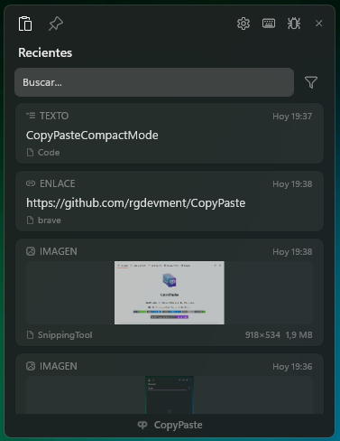

<div align="center">
  

  <h1>CopyPaste</h1>
  <h3>The Modern Clipboard Manager for Windows</h3>

  <p>
    <strong>High Performance • Open Source • Native Design</strong>
  </p>

  <p>
    <a href="https://github.com/rgdevment/CopyPaste/actions">
      
    </a>
    <a href="https://github.com/rgdevment/CopyPaste/releases">
      
    </a>
    
    <a href="#license">
      
    </a>
    <a href="https://github.com/rgdevment/CopyPaste/releases">
      
    </a>
  </p>

  <p align="center">
    <a href="https://apps.microsoft.com/detail/9NBJRZF3K856">
      
    </a>
  </p>

  <p align="center">
    <sub>Also available as a <a href="https://github.com/rgdevment/CopyPaste/releases/latest">standalone installer</a> from GitHub Releases.</sub>
  </p>
</div>

---

### A tool born from a personal need for harmony.

**CopyPaste** is not just a clipboard manager focused on performance. I don't believe power should be synonymous with something clunky or purely functional — this project is a pursuit of **visual harmony, aesthetics, and minimalism**.

My goal was to create something that felt truly **native**: a piece of software with the fluidity and care that feels like it should have always been there, integrated into the soul of Windows, but that we can now enjoy together.

---

### ✨ What Drives This Project

Sometimes, in our daily workflow, we just need something that's "just there" when we need it and disappears when we don't — without friction or unnecessary visual noise.

* **Aesthetics and Fluidity:** I was inspired by the cleanest workspaces to bring that same sense of calm to Windows. I use **WinUI 3** to ensure that every transition and every pixel feels like an integral part of the system, blending beauty and speed.
* **A Commitment to Respect:** Your data is yours. CopyPaste is **local-first**: nothing leaves your computer — no accounts, no telemetry, no tracking of any kind. A tool designed with privacy and absolute respect for your digital space.
* **Open Source and Shared:** This project is **GPL v3** because I want it to belong to the community. It's my way of sharing a tool I use every day to keep my workflow organized and pleasant.

---

### 🤝 Built for (and by) us

I don't see those who use CopyPaste as "end users," but as **collaborators** in this search for a better experience. If you value simplicity, speed, and above all, an aesthetic that respects your focus, this tool is for you. Your reports and suggestions are what help CopyPaste continue to evolve toward that perfect tool we always wanted to have.

> 🚀 **v1.0.0 Released** — I use CopyPaste every day on Windows 11, but every setup is different. If something feels off, [let me know](#-found-a-bug-have-feedback). Your feedback is what shapes this project.

---

## � Table of Contents

- [See It in Action](#-see-it-in-action)
- [Why I Built This](#-why-i-built-this)
- [What It Is / What It Isn't](#-what-it-is---what-it-isnt)
- [Who Is This For?](#-who-is-this-for)
- [Privacy & Security](#-privacy--security)
- [Key Features](#-key-features)
- [Keyboard Shortcuts](#️-keyboard-shortcuts)
- [Getting Started](#-getting-started)
- [FAQ](#-faq)
- [Found a Bug? Have Feedback?](#-found-a-bug-have-feedback)
- [Localization](#-localization-help-us-go-global)
- [Want to Help?](#-want-to-help)
- [Tech Stack (For Developers)](#-tech-stack-for-developers)
- [License & Spirit](#-license--spirit)

## 📸 See It in Action

<div align="center">
    
</div>
<div align="center"><em>Fast search, clean cards, and a native feel. This is CopyPaste in action.</em></div>

<br/>

<div align="center">
    
    &nbsp;&nbsp;
    
</div>
<div align="center"><em>Compact mode for quick access (left) and privacy-friendly settings (right).</em></div>

---

## 💡 Why I Built This

I didn't build CopyPaste to sell you something. I built it because **I needed it**—and I believe you might need it too.

### The Problem

There are clipboard managers out there, sure. But many feel clunky, outdated, or over-complicated. In 2026, software on Windows shouldn't feel like it was designed for Windows XP or Windows 7. It should feel **native, responsive, and beautiful**.

I was tired of:
- Tools that hog system resources
- Interfaces that feel disconnected from your OS
- Applications that treat you as a customer, not a collaborator
- Closed ecosystems where you're locked into someone else's vision

### What I'm Building (With Your Help)

**This started as a passion project**, not a startup chasing metrics. It's a personal project that I'm sharing with you:
- 🔒 **Your data stays yours** — Everything is local. I don't collect, track, or send anything anywhere. There's no analytics, no telemetry, nothing. Because I don't need to know what you're copying.
- 💻 **100% Open Source** — Every line of code is here for you to read, modify, or learn from
- 🆓 **Completely free** — No premium versions, no "pro" features locked behind paywalls
- 🤝 **Built together** — Your feedback shapes what this becomes. You're not a user, you're part of this

### What I'm Trying to Do

I wanted to bring the **polish and fluidity** you find in great tools to Windows. Things like:
- **Windows 11 design language** — so it feels native, not foreign
- **Performance** — every millisecond counts when you use something hundreds of times a day
- **Reliability** — something you can count on without thinking about it

---

## ✅ What It Is / ❌ What It Isn’t

**CopyPaste is:**
- A **local-first clipboard history** app for Windows 10/11.
- A **fast** tool designed for keyboard workflows.
- **Open source**, so you can inspect how it works.

**CopyPaste isn’t:**
- A cloud clipboard or sync service.
- A telemetry/analytics app.
- A “platform” with accounts, subscriptions, or ads.

---

## 👤 Who Is This For?

If you copy and paste all day, this is for you:

- **Students** collecting notes, quotes, and sources.
- **Developers** juggling snippets, commands, and logs.
- **Creators & writers** reusing text fragments and assets.
- **Support & operations** teams handling repetitive responses.
- **Anyone** who wants a clean, private clipboard history on Windows 10/11.

---

## 🔒 Privacy & Security

CopyPaste is built with a **privacy-first** mindset:

- **Local-only storage** — no cloud, no servers, no data syncing.
- **No tracking** — no telemetry, no analytics, no hidden collection.
- **Sensitive content is ignored** — passwords and password-manager copies aren’t saved.

**Non-goals (by design):** No accounts, no subscriptions, no ads, no cloud sync, no “AI analysis” of your clipboard.

For responsible disclosure and security contact info, see [SECURITY.md](SECURITY.md).

<details>
<summary><strong>Where is my data stored?</strong></summary>

CopyPaste stores its data locally under your Windows user profile:

- **Database:** `%LOCALAPPDATA%\CopyPaste\clipboard.db`
- **Images:** `%LOCALAPPDATA%\CopyPaste\images`
- **Thumbnails:** `%LOCALAPPDATA%\CopyPaste\thumbs`
- **Config:** `%LOCALAPPDATA%\CopyPaste\config`

</details>

If you care about privacy and control, this is made for you. Read our full [Privacy Policy](PRIVACY.md) for complete details.

## ✨ Key Features

> 🚀 **Latest Release** — See all features and improvements in our [Release Notes](https://github.com/rgdevment/CopyPaste/releases/latest).

* 🎨 **Feels Like Windows:** Uses your system theme (Light/Dark) and native controls—it doesn't feel foreign.
* ⚡ **Fast & Light:** Starts quickly and doesn't hog resources.
* 📂 **Handles Everything:** Text, images, files, audio, and video—with thumbnails so you know what's what.
* 🏷️ **Card Labels & Colors:** Personalize your clipboard items with custom labels (up to 40 characters) and 6 color options (Red, Green, Purple, Yellow, Blue, or None).
* 📌 **Pin Important Items:** Keep your most-used items always accessible at the top.
* 🔒 **Private by Default:** Everything stays on your computer. No cloud, no sync, no servers.
* 🔐 **Respects Sensitive Data:** Passwords and API keys aren't stored. Password managers (1Password, Bitwarden, etc.) are ignored—their clipboard content never gets saved.
* 🌐 **Multi-language:** English and Spanish supported, with automatic detection.
* ⌨️ **Full Keyboard Navigation:** Work without the mouse — navigate, search, and paste using only your keyboard.
* 📖 **Built-in Help:** Quick access to keyboard shortcuts reference window from the sidebar.
* 🔄 **Automatic Updates:** The Microsoft Store version updates seamlessly via Windows. The standalone installer notifies you when a new version is available.
* 🔍 **Full-Text Search:** Instantly find any item with powerful FTS5 search across content and labels.
* 🎛️ **Advanced Filters:** Three filter modes—Content (text search), Category (color selection), and Type (item type selection)—with intuitive dropdown multi-selection.
* 🔄 **Smart Filter Behavior:** Filters only apply to their active mode—switching modes automatically uses the relevant filter without mixing criteria.
* 📌 **Pin Indicators:** When searching or filtering, pinned items display a subtle pin icon in the footer, making them easy to identify among results.
* ⚙️ **Configurable:** Hotkeys, appearance, panel width (400-600px), retention days, filter reset behavior, and more.
* 🎨 **Multiple Themes:** Switch between built-in themes (Default and Compact) from settings to match your workflow.

---
## ⌨️ Keyboard Shortcuts

CopyPaste is designed for power users who prefer keyboard navigation:

| Shortcut | Action |
| :--- | :--- |
| `Win+Alt+V` | Open/close CopyPaste (default hotkey, customizable) |
| `↓` or `Tab` | Navigate from search to clipboard items |
| `↑` / `↓` | Navigate between clipboard items |
| `→` | Expand/collapse selected card to see more text |
| `Shift+Tab` | Return to search box |
| `Enter` | Paste selected item and return to previous app |
| `Delete` | Delete selected item |
| `P` | Pin/Unpin selected item |
| `E` | Edit card (add label and color) |
| `Ctrl+1` | Switch to Recent tab |
| `Ctrl+2` | Switch to Pinned tab |
| `Alt+C` | Switch to Content filter mode (text search) |
| `Alt+G` | Switch to Category filter mode (by color) |
| `Alt+T` | Switch to Type filter mode (by item type) |
| `Esc` | Clear current filter or close window |

### Card Customization
Each clipboard card can be personalized with:
- **Custom Label:** Add a descriptive name (up to 40 characters) to identify your items quickly
- **Color Indicator:** Choose from 6 colors (Red, Green, Purple, Yellow, Blue) or None to visually categorize your items

To edit a card:
- **Right-click** on any card → Select "Edit"
- **Press `E`** with a card selected
- **Click the `...` menu** on hover → Select "Edit" *(Default theme only)*

### Advanced Filters
CopyPaste includes three filter modes to help you find items quickly:

| Mode | Description | How to Use |
| :--- | :--- | :--- |
| **Content** | Text search (default) | Type in the search box to filter by content or label |
| **Category** | Filter by color | Select colors from the dropdown to show only items with selected colors |
| **Type** | Filter by item type | Select types from the dropdown to show only Text, Image, File, Folder, Link, Audio, or Video |

**Switching Filter Modes:**
- Click the filter icon (⚙) next to the search box → Select a mode from the flyout
- Use keyboard shortcuts: `Alt+C` (Content), `Alt+G` (Category), `Alt+T` (Type)

**How Filters Work:**
- Each mode applies only its relevant filter—text search in Content mode, colors in Category mode, types in Type mode
- Switching modes automatically uses the appropriate filter without mixing criteria
- In Category and Type modes, select multiple options from the dropdown for precise filtering
- Press `Esc` to clear the current filter
- When filtering, pinned items show a pin icon in the footer to help identify them

**Clearing Filters:** Press `Esc` to clear the current filter (search text, colors, or types depending on the active mode).

**Configurable Reset Behavior:** In Settings, you can configure whether filters reset when the window opens:
- Reset to Content mode on open
- Clear text search on open
- Clear category (color) filter on open
- Clear type filter on open

### Card Expansion
Clipboard items (cards) can be expanded to show more text content:

**With Mouse:**
- **Single click** on a card → Expand/collapse to see more text
- **Double click** on a card → Paste the item immediately
- Only one card can be expanded at a time
- All cards collapse when the window is hidden
- In **Default** theme, hovering a card reveals quick action buttons
- In **Compact** theme, cards have no hover effect (use right-click instead)

**With Keyboard:**
- **Right arrow `→`** → Expand/collapse the selected card
- Cards automatically collapse when you navigate to a different item with `↑`/`↓`
- Only one card can be expanded at a time

### Keyboard-Only Workflow
1. **Press `Win+Alt+V`** → Window opens with focus on search box
2. **Type to filter** (optional) → Results update in real-time (searches content and labels)
3. **Press `Esc`** (optional) → Clear search to see all items again
4. **Press `↓`** → Navigate to first clipboard item
5. **Use `↑`/`↓`** → Select the desired item
6. **Press `→`** (optional) → Expand card to see full text
7. **Press `E`** (optional) → Edit card to add label/color
8. **Press `Enter`** → Item is pasted to your previous application

This workflow matches the efficiency of double-clicking with your mouse but keeps your hands on the keyboard.

### Filter Configuration
In the **Settings** window, you can customize filter behavior:

- **Return to Content mode on open:** When enabled, always starts in Content mode (text search) when opening CopyPaste
- **Clear search on open:** Automatically clears the search text when opening the window
- **Clear category filter on open:** Resets color selections when opening (only applies if not returning to Content mode)
- **Clear type filter on open:** Resets type selections when opening (only applies if not returning to Content mode)

**Note:** If "Return to Content mode on open" is enabled, the other clear options are automatically disabled since returning to Content mode achieves the same result.

---

## 🚀 Getting Started

### Install from the Microsoft Store (Recommended)

The fastest and easiest way to get CopyPaste:

1. Get **CopyPaste** from the [**Microsoft Store**](https://apps.microsoft.com/detail/9NBJRZF3K856).
2. Click **Install** — no security warnings, automatic updates via the Store.
3. Open CopyPaste with `Win+Alt+V`.

> The Store version is framework-dependent (smaller download), updates automatically through Windows, and requires no additional setup.

<details>
<summary><strong>📥 Alternative: Standalone Installer (GitHub Releases)</strong></summary>

If you prefer a traditional installer or can't access the Microsoft Store:

1. Go to the [**Latest Release**](https://github.com/rgdevment/CopyPaste/releases/latest).
2. Download the **Installer (.exe)** for your architecture (x64 or ARM64).
3. Run it and open CopyPaste with `Win+Alt+V`.

The standalone version is fully self-contained — no runtime dependencies needed. Includes a native splash screen launcher and in-app update notifications.

#### ⚠️ Security Warnings (Self-Signed Certificate)

Since CopyPaste is an independent open-source project, we use a self-signed certificate. Windows and your browser may show security warnings — **this is normal and expected.**

- **Browser:** Chrome/Edge may block the download — click `Keep` or `Keep anyway`.
- **SmartScreen:** Click `More info` → `Run anyway` (only happens once).
- **Why?** Code signing certificates cost $200-800/year. The code is 100% open source — you can inspect every line. SHA256 checksums are provided for each release.

#### ✅ Verifying a Release

If you want extra confidence before running the installer:

1. Download the installer **and** the published SHA256 checksum from the same GitHub Release.
2. Compare the installer hash with the published value.

```powershell
Get-FileHash .\CopyPaste-Installer.exe -Algorithm SHA256
```

</details>

### How It Works

**Standalone (GitHub Releases):** CopyPaste uses a dual-process architecture:
- **`CopyPaste.exe`** — A lightweight native C++ launcher that shows a splash screen instantly.
- **`CopyPaste.App.exe`** — The main .NET application that runs in the background.

When you launch CopyPaste, the native launcher appears immediately while the .NET app initializes. Once ready, the splash closes automatically. This only takes a few seconds on first run; subsequent launches are nearly instant.

**Microsoft Store (MSIX):** The Store version launches `CopyPaste.App.exe` directly — no splash screen is needed because the .NET runtime and Windows App SDK are pre-installed as framework dependencies, resulting in fast startup times.

### Compatibility
* **OS:** Windows 10 (1809+) or Windows 11.
* **Architecture:** x64 and ARM64 supported on both distribution channels.
* **ARM64 Note:** Fully supported since v1.0.0. If you're running Windows on ARM and encounter any issues, please [open an issue](https://github.com/rgdevment/CopyPaste/issues).

---

## ❓ FAQ

**Is CopyPaste free?**
Yes. It’s completely free and open source.

**Does it upload my data?**
No. Everything stays on your PC.

**Does it store passwords?**
No. Passwords and clipboard content from password managers are ignored.

**Do I need internet to use it?**
No. It works fully offline.

**Does it sync between devices?**
No. There’s intentionally no cloud sync.

**Where are my files stored?**
Under `%LOCALAPPDATA%\CopyPaste\` (database, images, thumbnails, config, logs). Same location for both Store and standalone versions.

**What's the difference between the Store and standalone versions?**
Same features and same codebase. The **Microsoft Store version is recommended** — it's smaller (framework-dependent), updates automatically via Windows, and installs without any security warnings. The standalone version is available as an alternative for users who can't access the Store.

**Is it compatible with Windows 10 and 11?**
Yes, Windows 10 (1809+) and Windows 11 are supported.

## 🤝 Found a Bug? Have Feedback?

**Your feedback literally shapes what gets built next.** Here's how to reach me:

### How to Contribute Your Voice

| Type | How |
| :--- | :--- |
| 🐞 **Found a Bug?** | [Open an Issue](https://github.com/rgdevment/CopyPaste/issues/new) — tell me what happened and how to reproduce it |
| 💡 **Have an Idea?** | [Open an Issue](https://github.com/rgdevment/CopyPaste/issues/new) — tell me what you'd like to see |
| 💬 **Want to Chat?** | [Start a Discussion](https://github.com/rgdevment/CopyPaste/discussions) — ask anything or just say hi |
| ⭐ **Like It?** | Star the repo — helps other people find it |
| 📝 **Want to Code?** | [Check CONTRIBUTING.md](CONTRIBUTING.md) — PRs welcome |

**When reporting bugs, include:**
- Windows version (like Windows 11 23H2)
- What you were doing
- Any error messages
- CopyPaste version (check Settings)

---

## 🚧 What's Coming & What's Changed

I try to keep a clear record of what's been added, fixed, and what's planned:

📋 **[View Release Notes & Changelog](https://github.com/rgdevment/CopyPaste/releases)** — Complete history of all changes.

---

## 🌐 Localization: Help Us Go Global

CopyPaste should speak your language. Currently we support English and Spanish, but **we want to reach people everywhere**.

### Currently Supported Languages
| Language | Tag | Status |
| :--- | :---: | :---: |
| 🇨🇱 Spanish (Chile) | `es-CL` | ✅ Complete |
| 🇺🇸 English (US) | `en-US` | ✅ Complete |

### How It Works
- **Automatic Detection:** The app detects your Windows display language and applies the appropriate translation.
- **Regional Fallback:** If your exact region isn't available (e.g., `es-MX`), it falls back to the base language (e.g., `es-CL`).
- **Manual Override:** You can force a specific language in the Settings panel.

### 🤝 Help Us Translate—Your Language Matters!

**Can you contribute a translation?** We need help from people who care about their language and community. Whether it's German, French, Portuguese, Japanese, or anything else—your translation makes CopyPaste accessible to more people.

This isn't just translation work. **It's bridge-building.** You're bringing a tool to your community in the language they think in, speak in, and deserve to use.

#### Steps to Add a New Translation

1. **Create a branch** from `main` in the repository.

2. **Copy the base language file:**
   ```
   CopyPaste.UI/Localization/Languages/en-US.json
   ```
   This is the reference file with all translation keys.

3. **Name your file using BCP 47 language tags:**
   - `de-DE.json` (German - Germany)
   - `fr-FR.json` (French - France)
   - `pt-BR.json` (Portuguese - Brazil)
   - `ja-JP.json` (Japanese - Japan)
   - `zh-CN.json` (Chinese - Simplified)

   > 📖 [Full list of BCP 47 language tags](https://learn.microsoft.com/en-us/openspecs/windows_protocols/ms-lcid/a9eac961-e77d-41a6-90a5-ce1a8b0cdb9c)

4. **Translate all values** (keep the JSON keys in English):
   ```json
   {
     "window": {
       "title": "CopyPaste",
       "appBranding": "CopyPaste"
     },
     "ui": {
       "section": {
         "recent": "Récents",  // ← Translate this value
         "pinned": "Épinglés" // ← Translate this value
       }
       // ... continue for all keys
     }
   }
   ```

5. **Register your language** in `LocalizationService.cs`:
   ```csharp
   private static readonly string[] _availableLanguages = ["en-US", "es-CL", "de-DE"]; // Add yours
   ```

6. **(Optional) Add regional fallback** in `language-config.json`:
   ```json
   {
     "fallbacks": {
       "de": "de-DE",  // German variants → de-DE
       "fr": "fr-FR"   // French variants → fr-FR
     }
   }
   ```

7. **Test your translation** by changing your Windows language or using the manual override.

8. **Submit a Pull Request** with your translation!

#### Translation Guidelines
- ✅ Keep translations concise (UI space is limited)
- ✅ Use formal/neutral tone
- ✅ Preserve placeholders like `{shortcut}` or `{time}`
- ✅ Test that all strings fit in the UI
- ❌ Don't translate brand names (`CopyPaste`, `Windows`, etc.)
- ❌ Don't change JSON keys (only values)

---

## 🤝 Want to Help?

**CopyPaste** gets better when people contribute. That doesn't just mean code:

- **Write Code** — Fix bugs, add features. All skill levels welcome.
- **Improve Docs** — If something's confusing, help me explain it better.
- **Translate** — Add your language so more people can use it. [See guide](#-help-us-translate).
- **Report Bugs** — If something breaks, let me know.
- **Share Ideas** — Tell me what you wish it could do.
- **Spread the Word** — If you like it, tell people about it.
- **Just Use It** — Honestly? Using it and giving feedback is huge.

Please read our [**CONTRIBUTING.md**](CONTRIBUTING.md) for details on our code of conduct, setup instructions, and the process for submitting pull requests.

---

## 🛠 Tech Stack (For Developers)

If you're curious about what's under the hood:

| Technology | Why |
| :--- | :--- |
| **C# / .NET 10** | Modern C# features, good performance. |
| **WinUI 3** | Native Windows UI—looks and feels like it belongs. |
| **ReadyToRun** | Pre-compiled to start faster (standalone builds). |
| **Native C++ Launcher** | Shows something immediately while .NET loads. |
| **Win32 Interop** | Low-level clipboard hooks to catch everything. |
| **SQLite + FTS5** | Local storage with full-text search. |
| **SkiaSharp** | Generates image thumbnails. |
| **Theme System** | Multiple built-in themes via internal `ITheme` interface. |

---

## 🎨 Themes

CopyPaste includes multiple built-in themes that let you change how the application looks and behaves.

- **Default** — Full-featured sidebar layout with all options visible.
- **Compact** — Minimal popup that appears near your cursor, optimized for quick access.
- You can switch between themes from **Settings → General → Theme**.
- Changes require a restart to take effect.

---

## 📜 License & Spirit

**CopyPaste** - The ultimate clipboard tool for Windows.
Copyright (C) 2026 Mario Hidalgo G. (rgdevment)

This program comes with ABSOLUTELY NO WARRANTY.
This is free software, and you are welcome to redistribute it under certain conditions.
Distributed under the **GNU General Public License v3.0**. See `LICENSE` for more information.

---

## 🙏 One Last Thing

I believe software should make your life easier, not more complicated. I built CopyPaste because I was tired of the alternatives—and I figured maybe you were too.

**Here's the deal:** This started as my personal tool, but it's better when we build it together. Every bug report, feature suggestion, or translation makes it better for everyone using it.

I'm not trying to build a startup or make money from this. I just want to prove you can build something useful, share it freely, and do it all in the open.

If that sounds good to you, welcome. I'm glad you're here.

**Thanks for giving CopyPaste a shot. 💙**

<div align="center">
  <p>Built with ❤️, C#, and too much coffee.</p>
</div>
