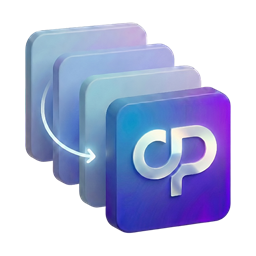
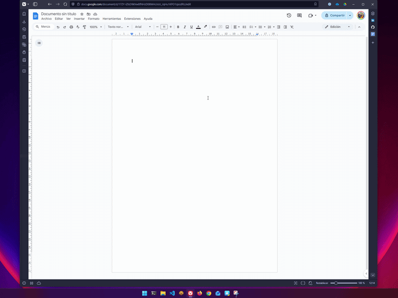
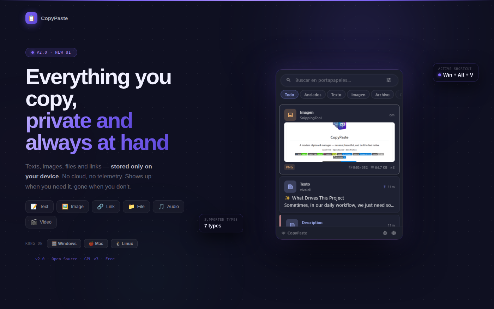
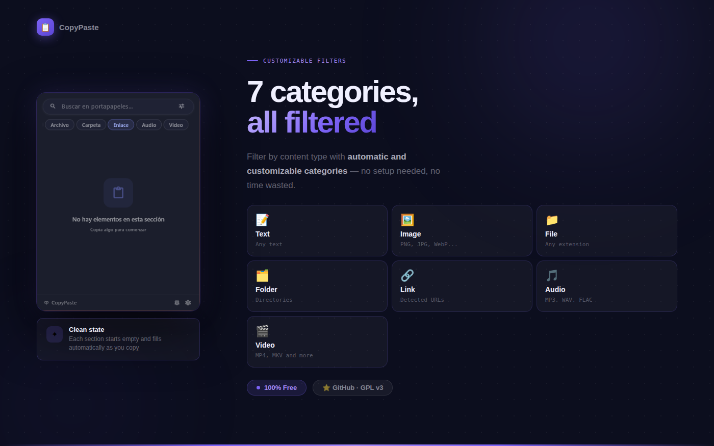

<div align="center">
  

  <h1>CopyPaste</h1>
  <h3>A modern clipboard manager — minimal, beautiful, and built to feel native</h3>

  <p>
    <strong>Local-First • Open Source • Zero Friction</strong>
  </p>

  <p>
    <a href="https://github.com/rgdevment/CopyPaste/actions/workflows/ci.yml">
      
    </a>
    <a href="https://sonarcloud.io/summary/overall?id=rgdevment_CopyPaste">
      
    </a>
    <a href="https://codecov.io/gh/rgdevment/CopyPaste">
      
    </a>
    <a href="https://github.com/rgdevment/CopyPaste/releases">
      
    </a>
    
    <a href="#license">
      
    </a>
    <a href="https://github.com/rgdevment/CopyPaste/releases">
      
    </a>
    <a href="https://github.com/rgdevment/CopyPaste/releases">
      
    </a>
    <a href="https://github.com/rgdevment/CopyPaste/releases">
      
    </a>
  </p>

  <h4>⬇️ Download</h4>

  <p align="center">
    <a href="https://apps.microsoft.com/detail/9NBJRZF3K856">
      
    </a>
    &nbsp;
    <a href="#-getting-started">
      
    </a>
    &nbsp;
    <a href="https://github.com/rgdevment/CopyPaste/releases/latest">
      
    </a>
    &nbsp;
    <a href="https://github.com/rgdevment/CopyPaste/releases/latest">
      
    </a>
  </p>

  <p align="center">
    <sub>Windows (.exe) &bull; macOS (.dmg universal — Apple Silicon + Intel) &bull; Linux (.deb / .rpm / .AppImage) &bull; <a href="#-getting-started">Installation guide</a></sub>
  </p>

  <p>
    <a href="https://buymeacoffee.com/rgdevment">
      
    </a>
  </p>
</div>

---

### An open source clipboard manager built for harmony, not just productivity

**CopyPaste** is not just a clipboard manager focused on performance. I don't believe power should be synonymous with something clunky or purely functional — this project is a pursuit of **visual harmony, aesthetics, and minimalism**.

My goal was to create something that felt truly **native**: a piece of software with the fluidity and care that feels like it should have always been there, integrated into the soul of your OS — whether that's Windows or macOS — but that we can now enjoy together.

---

### ✨ What Drives This Project

Sometimes, in our daily workflow, we just need something that's "just there" when we need it and disappears when we don't — without friction or unnecessary visual noise.

- **Aesthetics and Fluidity:** I was inspired by the cleanest workspaces to bring that same sense of calm to your desktop. Built on a **cross-platform UI and core** — so every transition feels like an integral part of the OS, not a widget dropped on top of it. The same foundation powers Windows, macOS, and Linux with a native feel on each.
- **A Commitment to Respect:** Your data is yours. CopyPaste is **local-first**: nothing leaves your computer — no accounts, no telemetry, no tracking of any kind. A tool designed with privacy and absolute respect for your digital space.
- **Open Source and Free:** This project is **GPL v3**. Free to use, free to fork, and always without subscriptions, telemetry, or data harvesting — ever.

---

### 🏠 Built to Belong

CopyPaste isn't a "power tool" you learn to tolerate — it's something that should feel like it was always part of the OS. Lightweight enough to forget it's running. Fast enough to never slow you down. Quiet enough to stay out of your way.

> 🚀 I use CopyPaste every day on Windows 11 and macOS. If something feels off, [let me know](#-found-a-bug-have-feedback) — this project keeps improving because of real-world use.

---

## � Table of Contents

- [See It in Action](#-see-it-in-action)
- [Why I Built This](#-why-i-built-this)
- [What It Is / What It Isn't](#-what-it-is---what-it-isnt)
- [Who Is This For?](#-who-is-this-for)
- [Privacy & Security](#-privacy--security)
- [Key Features](#-key-features)
- [Keyboard Shortcuts](#️-keyboard-shortcuts)
- [Getting Started](#-getting-started)
- [FAQ](#-faq)
- [Found a Bug? Have Feedback?](#-found-a-bug-have-feedback)
- [Localization](#-localization-help-us-go-global)
- [Want to Help?](#-want-to-help)
- [Tech Stack (For Developers)](#-tech-stack-for-developers)
- [License & Spirit](#-license--spirit)

## 📸 See It in Action

<div align="center">
    
</div>
<div align="center"><em>Fast search, clean cards, and a native feel. This is CopyPaste in action.</em></div>

<br/>

<div align="center">
    
    
    <br/><br/>
    
    
</div>

---

## 💡 Why I Built This

I didn't build CopyPaste to sell you something. I built it because **I needed it**—and I believe you might need it too.

### The Problem

There are clipboard managers out there, sure. But many feel clunky, outdated, or over-complicated. In 2026, software shouldn't feel like it was designed for a decade ago. It should feel **native, responsive, and beautiful** — on every platform.

I was tired of:

- Tools that hog system resources
- Interfaces that feel disconnected from your OS
- Applications that treat you as a customer, not a collaborator
- Closed ecosystems where you're locked into someone else's vision
- Windows-only tools that don't follow you to macOS

### What I Built

**This is a passion project**, not a startup chasing metrics. It started because I needed it, and ended up becoming something I'm proud to share:

- 🔒 **Your data stays yours** — Everything is local. No analytics, no telemetry, no accounts. I genuinely don't need to know what you're copying.
- 💻 **100% Open Source** — Every line of code is public. Read it, fork it, learn from it.
- 🆓 **Completely free** — No premium tiers, no subscriptions, no paywalls — now or ever.

### What I'm After

I wanted to bring the **polish and fluidity** you find in great tools to Windows. Things like:

- **Native system integration** — adapts to the OS light/dark theme and behaves like it belongs, wherever it runs. Mica effect on Windows, Sidebar material on macOS.
- **Performance** — every millisecond counts when you use something hundreds of times a day
- **Reliability** — something you can count on without thinking about it
- **Multiplatform** — Windows, macOS, and Linux

---

## ✅ What It Is / ❌ What It Isn’t

**CopyPaste is:**

- A **local-first clipboard history** app for Windows, macOS, and Linux.
- A **fast** tool designed for keyboard workflows.
- **Open source**, so you can inspect how it works.

**CopyPaste isn’t:**

- A cloud clipboard or sync service.
- A telemetry/analytics app.
- A “platform” with accounts, subscriptions, or ads.

---

## 👤 Who Is This For?

If you copy and paste all day, this is for you:

- **Students** collecting notes, quotes, and sources.
- **Developers** juggling snippets, commands, and logs.
- **Creators & writers** reusing text fragments and assets.
- **Support & operations** teams handling repetitive responses.
- **Anyone** who wants a clean, private clipboard history on their computer.

---

## 🔒 Privacy & Security

CopyPaste is built with a **privacy-first** mindset:

- **Local-only storage** — no cloud, no servers, no data syncing.
- **No tracking** — no telemetry, no analytics, no hidden collection.
- **Sensitive content is ignored** — passwords and password-manager copies aren’t saved.

**Non-goals (by design):** No accounts, no subscriptions, no ads, no cloud sync, no “AI analysis” of your clipboard.

For responsible disclosure and security contact info, see [SECURITY.md](SECURITY.md).

<details>
<summary><strong>Where is my data stored?</strong></summary>

CopyPaste stores its data locally under your user profile:

**Windows:**

- **Database:** `%LOCALAPPDATA%\CopyPaste\clipboard.db`
- **Images:** `%LOCALAPPDATA%\CopyPaste\images`
- **Config:** `%LOCALAPPDATA%\CopyPaste\config`

**macOS:**

- **Database:** `~/Library/Application Support/com.rgdevment.copypaste/CopyPaste/clipboard.db`
- **Images:** `~/Library/Application Support/com.rgdevment.copypaste/CopyPaste/images`
- **Config:** `~/Library/Application Support/com.rgdevment.copypaste/CopyPaste/config`

**Linux:**

- **Database:** `~/.local/share/com.rgdevment.copypaste/CopyPaste/clipboard.db`
- **Images:** `~/.local/share/com.rgdevment.copypaste/CopyPaste/images`
- **Config:** `~/.local/share/com.rgdevment.copypaste/CopyPaste/config`

</details>

If you care about privacy and control, this is made for you. Read our full [Privacy Policy](PRIVACY.md) for complete details.

## ✨ Key Features

> 🚀 **Latest Release** — See all features and improvements in our [Release Notes](https://github.com/rgdevment/CopyPaste/releases/latest).

- 🎨 **Adapts to Your System:** Follows your OS light or dark theme automatically — Mica on Windows, Sidebar material on macOS.
- ⚡ **Fast & Light:** Starts quickly and doesn't hog resources.
- 📂 **Handles Everything:** Text, images, files, folders, links, audio, and video — with content-aware previews.
- 🏷️ **Card Labels & Colors:** Personalize your clipboard items with custom labels (up to 50 characters) and 7 color options (Red, Green, Purple, Yellow, Blue, Orange, or None).
- 📌 **Pin Important Items:** Keep your most-used items always accessible at the top.
- 🔒 **Private by Default:** Everything stays on your computer. No cloud, no sync, no servers.
- 🔐 **Respects Sensitive Data:** Passwords and API keys aren't stored. Password managers (1Password, Bitwarden, etc.) are ignored — their clipboard content never gets saved.
- 🌐 **Multi-language:** English and Spanish supported, with automatic detection and manual override.
- ⌨️ **Full Keyboard Navigation:** Work without the mouse — navigate, search, and paste using only your keyboard.
- 🔍 **Smart Search:** Diacritic-insensitive full-text search (handles é, ñ, ø, ß, æ and more) across content and labels.
- 🎛️ **Advanced Filters:** Three filter modes — Content (text search), Category (color selection), and Type (item type selection) — with intuitive dropdown multi-selection.
- 💾 **Backup & Restore:** Export and import your clipboard history, images, and settings as `.cpbackup` files.
- 🔄 **Automatic Updates:** The Windows Store version updates via Windows. The standalone version checks for updates in the background. macOS and Linux notify you when a new version is available.
- ⚙️ **Highly Configurable:** Hotkeys, appearance, panel dimensions, retention days, paste timings, performance tuning, filter reset behavior, and more.
- 🖥️ **Multiplatform:** Windows, macOS, and Linux with native look and feel.

---

## ⌨️ Keyboard Shortcuts

CopyPaste is designed for power users who prefer keyboard navigation:

| Shortcut                  | Action                                              |
| :------------------------ | :-------------------------------------------------- |
| `Win+Alt+V` / `Cmd+Alt+V` | Open/close CopyPaste (default hotkey, customizable) |
| `↓` or `Tab`              | Navigate from search to clipboard items             |
| `↑` / `↓`                 | Navigate between clipboard items                    |
| `Space`                   | Expand/collapse selected card to see more text      |
| `Ctrl+F` / `Cmd+F`        | Focus search box                                    |
| `Enter`                   | Paste selected item and return to previous app      |
| `Delete`                  | Delete selected item                                |
| `P`                       | Pin/Unpin selected item                             |
| `E`                       | Edit card (add label and color)                     |
| `Ctrl+1`                  | Switch to Recent tab                                |
| `Ctrl+2`                  | Switch to Pinned tab                                |
| `Alt+C`                   | Switch to Content filter mode (text search)         |
| `Alt+G`                   | Switch to Category filter mode (by color)           |
| `Alt+T`                   | Switch to Type filter mode (by item type)           |
| `Esc`                     | Clear current filter or close window                |

### Card Customization

Each clipboard card can be personalized with:

- **Custom Label:** Add a descriptive name (up to 40 characters) to identify your items quickly
- **Color Indicator:** Choose from 6 colors (Red, Green, Purple, Yellow, Blue) or None to visually categorize your items

To edit a card:

- **Right-click** on any card → Select "Edit"
- **Press `E`** with a card selected
- **Click the `...` menu** on hover → Select "Edit" _(Default theme only)_

### Advanced Filters

CopyPaste includes three filter modes to help you find items quickly:

| Mode         | Description           | How to Use                                                                                   |
| :----------- | :-------------------- | :------------------------------------------------------------------------------------------- |
| **Content**  | Text search (default) | Type in the search box to filter by content or label                                         |
| **Category** | Filter by color       | Select colors from the dropdown to show only items with selected colors                      |
| **Type**     | Filter by item type   | Select types from the dropdown to show only Text, Image, File, Folder, Link, Audio, or Video |

**Switching Filter Modes:**

- Click the filter icon (⚙) next to the search box → Select a mode from the flyout
- Use keyboard shortcuts: `Alt+C` (Content), `Alt+G` (Category), `Alt+T` (Type)

**How Filters Work:**

- Each mode applies only its relevant filter—text search in Content mode, colors in Category mode, types in Type mode
- Switching modes automatically uses the appropriate filter without mixing criteria
- In Category and Type modes, select multiple options from the dropdown for precise filtering
- Press `Esc` to clear the current filter
- When filtering, pinned items show a pin icon in the footer to help identify them

**Clearing Filters:** Press `Esc` to clear the current filter (search text, colors, or types depending on the active mode).

**Configurable Reset Behavior:** In Settings, you can configure whether filters reset when the window opens:

- Reset to Content mode on open
- Clear text search on open
- Clear category (color) filter on open
- Clear type filter on open

### Card Expansion

Clipboard items (cards) can be expanded to show more text content:

**With Mouse:**

- **Single click** on a card → Expand to see full text (click again to collapse)
- **Double click** on a card → Paste the item immediately to your previous app
- Only one card can be expanded at a time
- All cards collapse when the window is hidden
- In **Default** theme, hovering a card reveals quick action buttons
- In **Compact** theme, cards have no hover effect (use right-click instead)

> **Note:** Double-click always collapses the card before pasting, so your last click state is always clean.

**With Keyboard:**

- **Right arrow `→`** → Expand/collapse the selected card
- Cards automatically collapse when you navigate to a different item with `↑`/`↓`
- Only one card can be expanded at a time

### Keyboard-Only Workflow

1. **Press `Win+Alt+V`** → Window opens with focus on search box
2. **Type to filter** (optional) → Results update in real-time (searches content and labels)
3. **Press `Esc`** (optional) → Clear search to see all items again
4. **Press `↓`** → Navigate to first clipboard item
5. **Use `↑`/`↓`** → Select the desired item
6. **Press `→`** (optional) → Expand card to see full text
7. **Press `E`** (optional) → Edit card to add label/color
8. **Press `Enter`** → Item is pasted to your previous application

This workflow matches the efficiency of double-clicking with your mouse but keeps your hands on the keyboard.

### Filter Configuration

In the **Settings** window, you can customize filter behavior:

- **Return to Content mode on open:** When enabled, always starts in Content mode (text search) when opening CopyPaste
- **Clear search on open:** Automatically clears the search text when opening the window
- **Clear category filter on open:** Resets color selections when opening (only applies if not returning to Content mode)
- **Clear type filter on open:** Resets type selections when opening (only applies if not returning to Content mode)

**Note:** If "Return to Content mode on open" is enabled, the other clear options are automatically disabled since returning to Content mode achieves the same result.

---

## 🚀 Getting Started

| Platform    | Recommended                                                                                                                       | Alternative                                                                                      |
| :---------- | :-------------------------------------------------------------------------------------------------------------------------------- | :----------------------------------------------------------------------------------------------- |
| **Windows** | [**Microsoft Store**](https://apps.microsoft.com/detail/9NBJRZF3K856) — one click, auto-updates                                   | [Standalone .exe](https://github.com/rgdevment/CopyPaste/releases/latest) from GitHub Releases   |
| **macOS**   | [**Homebrew**](https://github.com/rgdevment/CopyPaste/releases/latest): `brew tap rgdevment/tap && brew install --cask copypaste` | [Universal .dmg](https://github.com/rgdevment/CopyPaste/releases/latest) (Apple Silicon + Intel) |
| **Linux**   | [**.deb**](https://github.com/rgdevment/CopyPaste/releases/latest) — Debian, Ubuntu, Pop!_OS and derivatives                      | [**.rpm**](https://github.com/rgdevment/CopyPaste/releases/latest) (Fedora / RHEL) · [**.AppImage**](https://github.com/rgdevment/CopyPaste/releases/latest) (universal, no install needed)  |

After installing, open CopyPaste with **`Win+Alt+V`** (Windows), **`Cmd+Alt+V`** (macOS), or **`Super+Alt+V`** (Linux).

### Compatibility

| Platform    | Versions                       | Architecture                      |
| :---------- | :----------------------------- | :-------------------------------- |
| **Windows** | Windows 10 (1809+), Windows 11 | x64                               |
| **macOS**   | Ventura (13.0+)                | Universal (Apple Silicon + Intel)            |
| **Linux**   | Ubuntu 22.04+ · Fedora 38+ · RHEL-compatible | x64 · `.deb`, `.rpm`, `.AppImage`            |

<details>
<summary><strong>🐧 Linux: Installation Instructions</strong></summary>

**AppImage** — universal, no installation needed:

```bash
chmod +x CopyPaste-*.AppImage
./CopyPaste-*.AppImage
```

**Debian / Ubuntu (.deb):**

```bash
sudo dpkg -i copypaste_*.deb
```

**Fedora / RHEL (.rpm):**

```bash
sudo dnf install copypaste_*.rpm
# or: sudo rpm -i copypaste_*.rpm
```

> **Note:** On first launch CopyPaste will ask for Accessibility (AT-SPI2) permissions — this is required to detect the frontmost app and paste back to it.

</details>

<details>
<summary><strong>⚠️ Windows Standalone: Security Warnings</strong></summary>

Since CopyPaste is an independent open-source project, we use a self-signed certificate. Windows and your browser may show security warnings — **this is normal and expected.**

- **Browser:** Chrome/Edge may block the download — click `Keep` or `Keep anyway`.
- **SmartScreen:** Click `More info` → `Run anyway` (only happens once).
- **Why?** Code signing certificates cost $200-800/year. The code is 100% open source — you can inspect every line. SHA256 checksums are provided for each release.

</details>

---

## ❓ FAQ

**Is CopyPaste free?**
Yes. It’s completely free and open source.

**Does it upload my data?**
No. Everything stays on your machine.

**Does it store passwords?**
No. Passwords and clipboard content from password managers are ignored.

**Do I need internet to use it?**
No. It works fully offline. The standalone version makes a lightweight check for updates (no user data sent), but works perfectly without a connection.

**Does it sync between devices?**
No. There’s intentionally no cloud sync.

**Where are my files stored?**
Windows: `%LOCALAPPDATA%\CopyPaste\` — macOS: `~/Library/Application Support/com.rgdevment.copypaste/CopyPaste/` — Linux: `~/.local/share/com.rgdevment.copypaste/CopyPaste/`. All contain the database, images, config, and logs.

**What platforms are supported?**
Windows 10/11, macOS (Ventura+), and Linux (Ubuntu 22.04+ via `.deb` or `.AppImage` · Fedora 38+ via `.rpm` or `.AppImage`).

**Does the macOS version work on Intel Macs?**
Yes. The DMG contains a universal binary that runs natively on both Apple Silicon (M1/M2/M3/M4) and Intel Macs.

## 🤝 Found a Bug? Have Feedback?

**Your feedback literally shapes what gets built next.** Here's how to reach me:

### How to Contribute Your Voice

| Type                 | How                                                                                                                |
| :------------------- | :----------------------------------------------------------------------------------------------------------------- |
| 🐞 **Found a Bug?**  | [Open an Issue](https://github.com/rgdevment/CopyPaste/issues/new) — tell me what happened and how to reproduce it |
| 💡 **Have an Idea?** | [Open an Issue](https://github.com/rgdevment/CopyPaste/issues/new) — tell me what you'd like to see                |
| 💬 **Want to Chat?** | [Start a Discussion](https://github.com/rgdevment/CopyPaste/discussions) — ask anything or just say hi             |
| ⭐ **Like It?**      | Star the repo — helps other people find it                                                                         |
| 📝 **Want to Code?** | [Check CONTRIBUTING.md](CONTRIBUTING.md) — PRs welcome                                                             |

**When reporting bugs, include:**

- OS and version (e.g., Windows 11 23H2, macOS Sonoma 14.5)
- What you were doing
- Any error messages
- CopyPaste version (check Settings)

---

## 🚧 What's Coming & What's Changed

I try to keep a clear record of what's been added, fixed, and what's planned:

📋 **[View Release Notes & Changelog](https://github.com/rgdevment/CopyPaste/releases)** — Complete history of all changes.

---

## 🌐 Localization: Help Us Go Global

CopyPaste should speak your language. Currently we support English and Spanish, but **we want to reach people everywhere**.

### Currently Supported Languages

| Language           |   Tag   |   Status    |
| :----------------- | :-----: | :---------: |
| 🇨🇱 Spanish (Chile) | `es-CL` | ✅ Complete |
| 🇺🇸 English (US)    | `en-US` | ✅ Complete |

### How It Works

- **Automatic Detection:** The app detects your system language and applies the appropriate translation.
- **Regional Fallback:** If your exact region isn't available (e.g., `es-MX`), it falls back to the base language (e.g., `es-CL`).
- **Manual Override:** You can force a specific language in the Settings panel.

### 🤝 Help Add a New Language

CopyPaste uses Flutter's standard ARB-based localization. Adding a new language requires creating one file.

#### Steps to Add a New Translation

1. **Create a branch** from `main` in the repository.

2. **Copy the base language file:**

    ```bash
    app/lib/l10n/app_en.arb
    ```

    This is the reference file with all translation keys.

3. **Name your file using the language code:**
    - `app_de.arb` (German)
    - `app_fr.arb` (French)
    - `app_pt.arb` (Portuguese - Brazil)
    - `app_ja.arb` (Japanese)

4. **Translate the values** (keep the keys in English — only change values):

    ```json
    {
        "@@locale": "de",
        "searchPlaceholder": "Suche im Zwischenablage…",
        "emptyStateSubtitle": "Kopiere etwas, um zu starten",
        "pinned": "Angeheftet",
        "recent": "Zuletzt"
    }
    ```

5. **Run `flutter gen-l10n`** (or `flutter pub get`) to regenerate the localization classes.

6. **Test your translation** by changing your system language or using the manual override in Settings.

7. **Submit a Pull Request** with your ARB file!

#### Translation Guidelines

- ✅ Keep translations concise — UI space is limited
- ✅ Use formal or neutral tone
- ✅ Preserve ARB placeholders like `{name}` or `{count}`
- ✅ Include `"@@locale": "xx"` at the top of the file
- ❌ Don't translate brand names (`CopyPaste`, `Windows`, etc.)
- ❌ Don't change ARB keys (only values)

---

## 🤝 Want to Help?

Contributions are always appreciated — whether that's a bug report, a translation, or a pull request:

- **Write Code** — Fix bugs or add features. See [CONTRIBUTING.md](CONTRIBUTING.md) for setup.
- **Translate** — Add your language. [See guide](#-localization-help-us-go-global).
- **Report Bugs** — If something breaks, [open an issue](https://github.com/rgdevment/CopyPaste/issues/new).
- **Share Ideas** — Tell me what you wish it could do.

---

## 🛠 Tech Stack (For Developers)

If you're curious about what's under the hood:

| Technology                         | Why                                                                                   |
| :--------------------------------- | :------------------------------------------------------------------------------------ |
| **Flutter**                        | Cross-platform UI toolkit — native on Windows, macOS, and Linux.                      |
| **Dart**                           | Clean, performant language for core logic, services, and domain models.               |
| **Platform Channels + FFI**        | Native integration with each OS for clipboard hooks and system APIs.                  |
| **Windows Mica / macOS Sidebar**   | Native translucent effects that match each platform's design language.                |
| **C++ Plugin (Win) / Swift (Mac)** | Low-level clipboard listener to capture every content type before the OS discards it. |
| **Native C++ Launcher (Win)**      | Lightweight splash process that appears instantly while Flutter warms up.             |
| **SQLite (Drift) + FTS5**          | Local database with full-text search across content and labels.                       |
| **WinSparkle (Windows)**           | Auto-update framework for standalone Windows distribution.                            |
| **Theme System**                   | Built-in Default and Compact themes, plus custom theme support via external packages. |

---

## 🎨 Themes

CopyPaste follows your system theme automatically — no configuration needed.

- **Light** — Clean and bright, matching a light OS theme.
- **Dark** — Easy on the eyes, matching a dark OS theme.
- You can override the automatic selection in **Settings → General → Theme**.

---

## 📜 License & Spirit

**CopyPaste** - A modern clipboard manager for Windows, macOS, and Linux.
Copyright (C) 2026 Mario Hidalgo G. (rgdevment)

This program comes with ABSOLUTELY NO WARRANTY.
This is free software, and you are welcome to redistribute it under certain conditions.
Distributed under the **GNU General Public License v3.0**. See `LICENSE` for more information.

---

## 🙏 One Last Thing

I believe software should make your life easier, not more complicated. I built CopyPaste because I was tired of the alternatives — toolbar-heavy, resource-hungry, or just plain ugly.

**Here's what this is:** A personal tool, built from a real need, shared because others might need it too. Free to use, free to inspect, free forever. No analytics, no subscription, no upsell — ever.

If that sounds good to you, I hope it serves you well — on Windows, macOS, or wherever you work.

### Thanks for giving CopyPaste a shot. 💙

<div align="center">
  <p>Built with ❤️ and too much coffee.</p>
</div>
