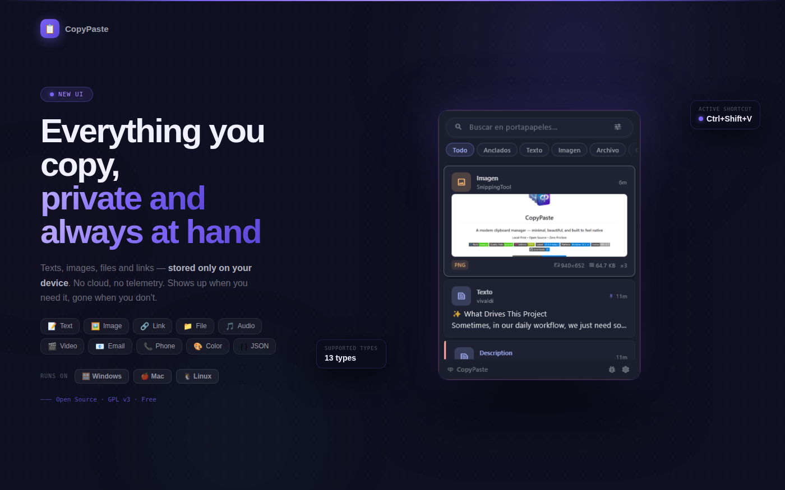
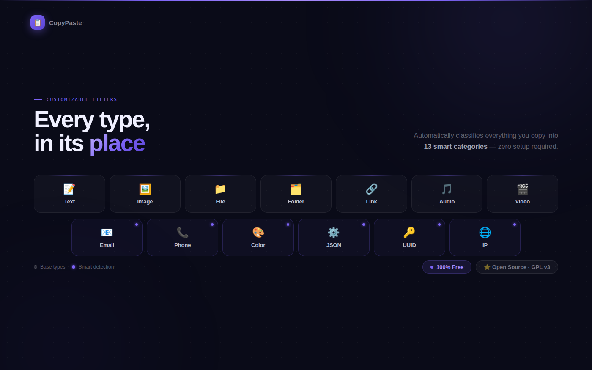
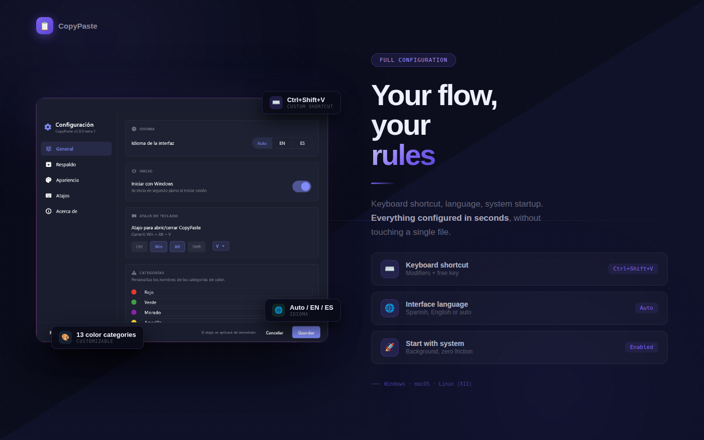
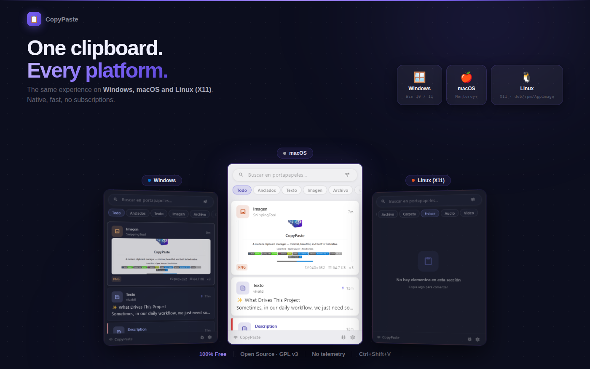



  

  <h1>CopyPaste — Free Open Source Clipboard Manager</h1>
  
<strong>A local-first clipboard history and copy paste tool for Windows, macOS and Linux. No ads. No telemetry. No accounts. Just a fast, private clipboard utility built for productivity.</strong>

  

    
    
    
    
    
    
  

  <h4>Download CopyPaste</h4>

  

    
    &nbsp;
    
    &nbsp;
    
  

  

    Prefer a direct download? <a href="https://github.com/rgdevment/CopyPaste/releases/latest">GitHub Releases</a> has standalone installers — Windows (.exe) · macOS (.dmg) · Linux (.AppImage · .deb · .rpm)
  

  

    
  

---

**CopyPaste** is a free, open source **clipboard manager** and **clipboard history** tool I built because the alternatives frustrated me. Most copy paste utilities are either bloated, ugly, or treat you as a product. I wanted a **copy tool** that felt native, respected my privacy, and just worked — so I built one and shared it.

This isn't a company product. I'm a developer who needed a better **copy paste** tool for my desktop, built it for myself, and decided to open source it for anyone who feels the same. No ads, no telemetry, no subscriptions, no data collection — just a lightweight **clipboard utility** that lives on your machine and nowhere else.

**Why people choose CopyPaste over other clipboard managers:**

- **100% local** — your clipboard history never leaves your computer. No cloud, no servers, no accounts.
- **Truly free** — no premium tiers, no feature gates, no "free trial" tricks. GPL v3, forever.
- **Cross-platform** — same native copy-paste experience on Windows, macOS, and Linux (beta).
- **Fast and light** — starts in milliseconds, uses minimal resources. You'll forget it's running.
- **Beautiful** — follows your OS theme (light/dark), with Mica effect on Windows and native materials on macOS.

> I use CopyPaste every day on Windows 11 and macOS. If something feels off, [let me know](#found-a-bug-have-feedback) — this project keeps improving because of real-world use.
>
> **Linux is in beta.** It works, but there are edge cases across different desktop environments. If you're on Linux and want to help, [your feedback matters](#found-a-bug-have-feedback).

---

## Table of Contents

- [See It in Action](#see-copypaste-in-action)
- [Why I Built This](#why-i-built-this)
- [What It Is / What It Isn't](#what-it-is--what-it-isnt)
- [Who Is This For?](#who-is-this-for)
- [Privacy and Security](#privacy-and-security)
- [Key Features](#key-features)
- [Keyboard Shortcuts](#keyboard-shortcuts)
- [Getting Started](#getting-started)
- [FAQ](#faq)
- [Support and Bug Reporting](#support-and-bug-reporting)
- [Clean Install and Reset](#clean-install-and-reset)
- [Found a Bug? Have Feedback?](#found-a-bug-have-feedback)
- [Localization](#localization-help-translate-copypaste)
- [Want to Help?](#want-to-help)
- [Tech Stack](#tech-stack-for-developers)
- [License and Spirit](#license-and-spirit)

## See CopyPaste in Action

    

<em>Fast search, clean cards, and a native feel across Windows and macOS.</em>

 

    
    
      
    
    

---

## Why I Built This

I'm not a company. I'm a developer who copies and pastes things hundreds of times a day — and got frustrated.

Most **clipboard managers** out there are either bloated, ugly, Windows-only, or silently collecting your data. In 2026, a **copy paste tool** should feel native, responsive, and beautiful on every platform. I couldn't find one that did, so I built my own.

**CopyPaste started as a personal productivity tool.** I needed a lightweight **copy history** utility that:

- Didn't hog system resources
- Looked and felt like part of my OS, not a widget dropped on top
- Worked on both Windows and macOS (and eventually Linux)
- Didn't require an account, subscription, or internet connection
- Actually respected my privacy — not just claimed to

After months of using it myself, I realized others might need it too. So I open sourced it — no ads, no monetization, no strings attached.

Every line of code is public. You can read it, fork it, or learn from it. This is a **free, open source productivity tool** — a copy tool built from a real need, not a business plan.

---

## What It Is / What It Isn't

**CopyPaste is:**

- A **local-first clipboard manager** and **clipboard history** app for Windows, macOS, and Linux
- A fast, keyboard-driven **copy-paste utility** for daily productivity and workflow efficiency
- A **copy tool** you can trust — **open source** (GPL v3), inspect every line, fork it, contribute to it

**CopyPaste is not:**

- A cloud clipboard or sync service
- A telemetry or analytics tool
- A "platform" with accounts, subscriptions, or ads
- A corporate product — it's a personal project shared with the community

---

## Who Is This For?

If you copy and paste throughout your day, this **clipboard manager** is for you:

- **Developers** juggling code snippets, terminal commands, and log outputs — a real productivity boost
- **Students** collecting notes, quotes, and research sources into a searchable **copy history**
- **Writers and creators** reusing text fragments and assets across documents
- **Support and operations** teams handling repetitive copy-paste responses
- **Anyone** who wants a clean, private, free **clipboard history** tool on their computer

---

## Privacy and Security

**Everything stays local.** CopyPaste is built on a single, non-negotiable principle: your clipboard data never leaves your computer. This copy-paste tool was designed with privacy as the foundation, not an afterthought.

- **Local-only storage** — no cloud, no servers, no data syncing
- **No tracking** — no telemetry, no analytics, no hidden collection of any kind
- **No automatic reporting** — errors are logged locally; nothing is sent without your explicit action
- **Sensitive content is ignored** — passwords and password-manager copies (1Password, Bitwarden, etc.) aren't saved
- **Log export is voluntary** — you choose when and what to share; logs never contain clipboard content

**By design, CopyPaste will never have:** accounts, subscriptions, ads, cloud sync, or "AI analysis" of your clipboard.

For responsible disclosure and security contact info, see [SECURITY.md](SECURITY.md).

<strong>Where is my clipboard data stored?</strong>

CopyPaste stores all data locally under your user profile:

**Windows:**

- **Database:** `%LOCALAPPDATA%\CopyPaste\clipboard.db`
- **Images:** `%LOCALAPPDATA%\CopyPaste\images`
- **Config:** `%LOCALAPPDATA%\CopyPaste\config`

**macOS:**

- **Database:** `~/Library/Application Support/com.rgdevment.copypaste/CopyPaste/clipboard.db`
- **Images:** `~/Library/Application Support/com.rgdevment.copypaste/CopyPaste/images`
- **Config:** `~/Library/Application Support/com.rgdevment.copypaste/CopyPaste/config`

**Linux:**

- **Database:** `~/.local/share/com.rgdevment.copypaste/CopyPaste/clipboard.db`
- **Images:** `~/.local/share/com.rgdevment.copypaste/CopyPaste/images`
- **Config:** `~/.local/share/com.rgdevment.copypaste/CopyPaste/config`

If you care about privacy and control, this clipboard manager is made for you. Read the full [Privacy Policy](PRIVACY.md) for complete details.

## Key Features

**Latest Release** — See all features and improvements in the [Release Notes](https://github.com/rgdevment/CopyPaste/releases/latest).

### Privacy and Security
- **Private by Default:** All clipboard history stays on your computer. No cloud, no sync, no servers.
- **Respects Sensitive Data:** Passwords and API keys aren't stored. Password managers (1Password, Bitwarden, etc.) are ignored — their clipboard content never gets saved.

### Design and Experience
- **Adapts to Your System:** Follows your OS light or dark theme automatically — Mica on Windows, Sidebar material on macOS.
- **Fast and Lightweight:** Starts quickly and doesn't hog resources. Lightweight enough to forget it's running.
- **Multiplatform:** The same native look, feel, and functionality across Windows, macOS, and Linux.

### Smart Clipboard Management
- **Handles Everything:** Text, images, files, folders, links, audio, and video — with content-aware previews. A copy tool that actually understands what you copy.
- **Smart Content Detection:** Automatically recognizes and categorizes content — emails, phone numbers (with country), colors (HEX/RGB/HSL with swatch), IP addresses, UUIDs, and JSON. Each type gets its own icon, badge, and filter.
- **Open with Default App:** Files, images, links, emails, and phone numbers open directly in your OS's default app — the copy-paste manager stays out of the way.

### Workflow and Productivity
- **Full Keyboard Navigation:** Navigate, search, and paste your copy history using only your keyboard — a clipboard utility built for speed.
- **Smart Search:** Diacritic-insensitive full-text search (handles é, ñ, ø, ß, æ and more) across content and labels.
- **Card Labels and Colors:** Personalize your copy-paste items with custom labels (up to 50 characters) and 7 color options to identify your snippets at a glance.
- **Advanced Filters:** Three filter modes — Content (text search), Category (color selection), and Type (item type) — with dropdown multi-selection.
- **Pin Important Items:** Keep your most-used copy-paste fragments always accessible at the top.
- **Backup and Restore:** Export and import your clipboard history, images, and settings as `.cpbackup` files.

---

## Keyboard Shortcuts

CopyPaste is designed for power users who prefer keyboard navigation:

| Shortcut                                 | Action                                              |
| :--------------------------------------- | :-------------------------------------------------- |
| Ctrl+Alt+V                               | Open/close CopyPaste (default hotkey, customizable) |
| ↓ or Tab                                 | Navigate from search to clipboard items             |
| ↑ / ↓                                    | Navigate between clipboard items                    |
| Space                                    | Expand/collapse selected card to see more text      |
| Ctrl+F / Cmd+F                           | Focus search box                                    |
| Enter                                    | Paste selected item and return to previous app      |
| Delete                                   | Delete selected item                                |
| P                                        | Pin/Unpin selected item                             |
| E                                        | Edit card (add label and color)                     |
| Ctrl+1                                   | Switch to Recent tab                                |
| Ctrl+2                                   | Switch to Pinned tab                                |
| Alt+C                                    | Switch to Content filter mode (text search)         |
| Alt+G                                    | Switch to Category filter mode (by color)           |
| Alt+T                                    | Switch to Type filter mode (by item type)           |
| Esc                                      | Clear current filter or close window                |

### Card Customization

Each clipboard card can be personalized with:

- **Custom Label:** Add a descriptive name (up to 50 characters) to identify your items quickly
- **Color Indicator:** Choose from 6 colors (Red, Green, Purple, Yellow, Blue, Orange) or None to visually categorize your items

To edit a card:

- **Right-click** on any card → Select "Edit"
- **Press E** with a card selected
- **Click the ... menu** on hover → Select "Edit" _(Default theme only)_

### Advanced Filters

CopyPaste includes three filter modes to help you find items in your clipboard history quickly:

| Mode         | Description           | How to Use                                                                                   |
| :----------- | :-------------------- | :------------------------------------------------------------------------------------------- |
| **Content** | Text search (default) | Type in the search box to filter by content or label                                         |
| **Category** | Filter by color       | Select colors from the dropdown to show only items with selected colors                      |
| **Type** | Filter by item type   | Select from the dropdown to filter by content type                                           |

**Switching Filter Modes:**

- Click the filter icon next to the search box and select a mode from the flyout
- Use keyboard shortcuts: Alt+C (Content), Alt+G (Category), Alt+T (Type)

**How Filters Work:**

- Each mode applies only its relevant filter — text search in Content mode, colors in Category mode, types in Type mode
- Switching modes automatically uses the appropriate filter without mixing criteria
- In Category and Type modes, select multiple options from the dropdown for precise filtering
- Press Esc to clear the current filter
- When filtering, pinned items show a pin icon in the footer to help identify them

**Clearing Filters:** Press Esc to clear the current filter (search text, colors, or types depending on the active mode).

**Configurable Reset Behavior:** In Settings, you can configure whether filters reset when the window opens:

- Reset to Content mode on open
- Clear text search on open
- Clear category (color) filter on open
- Clear type filter on open

### Card Expansion

Clipboard items (cards) can be expanded to show more text content:

**With Mouse:**

- **Single click** on a card → Expand to see full text (click again to collapse)
- **Double click** on a card → Paste the item immediately to your previous app
- Only one card can be expanded at a time
- All cards collapse when the window is hidden
- In **Default** theme, hovering a card reveals quick action buttons
- In **Compact** theme, cards have no hover effect (use right-click instead)

Double-click always collapses the card before pasting, so your last click state is always clean.

**With Keyboard:**

- **Right arrow →** → Expand/collapse the selected card
- Cards automatically collapse when you navigate to a different item with ↑/↓
- Only one card can be expanded at a time

### Keyboard-Only Workflow

1. **Press Ctrl+Alt+V** (default hotkey, customizable in Settings) → Window opens with focus on search box
2. **Type to filter** (optional) → Results update in real-time (searches content and labels)
3. **Press Esc** (optional) → Clear search to see all items again
4. **Press ↓** → Navigate to first clipboard item
5. **Use ↑/↓** → Select the desired item
6. **Press →** (optional) → Expand card to see full text
7. **Press E** (optional) → Edit card to add label/color
8. **Press Enter** → Item is pasted to your previous application

This copy-paste workflow matches the efficiency of double-clicking with your mouse but keeps your hands on the keyboard.

### Filter Configuration

In the **Settings** window, you can customize filter behavior:

- **Return to Content mode on open:** When enabled, always starts in Content mode (text search) when opening CopyPaste
- **Clear search on open:** Automatically clears the search text when opening the window
- **Clear category filter on open:** Resets color selections when opening (only applies if not returning to Content mode)
- **Clear type filter on open:** Resets type selections when opening (only applies if not returning to Content mode)

If "Return to Content mode on open" is enabled, the other clear options are automatically disabled since returning to Content mode achieves the same result.

---

## Getting Started

### Microsoft Store — Windows

The simplest way on Windows — one click, auto-updates, no security warnings.

  

---

### Homebrew

**macOS:**

    brew tap rgdevment/tap && brew install --cask copypaste

---

### Linux — apt / dnf

> **Linux support is in beta.** Core clipboard manager features work well across tested distributions, but you may encounter issues depending on your desktop environment, display server, or distro. [Please report anything unusual](https://github.com/rgdevment/CopyPaste/issues/new) — your reports directly shape stability improvements.

Packages are hosted on [Cloudsmith](https://cloudsmith.io/~rgdevment/repos/copypaste/) — set up the repository once, then get updates through your system package manager.

**Debian, Ubuntu, Pop!\_OS and derivatives:**

    curl -1sLf 'https://dl.cloudsmith.io/public/rgdevment/copypaste/setup.deb.sh' | sudo -E bash
    sudo apt install copypaste

**Fedora, RHEL, CentOS Stream and derivatives:**

    curl -1sLf 'https://dl.cloudsmith.io/public/rgdevment/copypaste/setup.rpm.sh' | sudo -E bash
    sudo dnf install copypaste

> **Note:** Requires an **X11 session**. On Wayland, global hotkey and auto-paste are unavailable — a warning is shown at startup.
> **Permissions note:** apt/dnf installation writes to system locations, so sudo is required. If your user cannot use sudo, those commands will fail with permission errors.
> **No-sudo alternatives:** Use **Homebrew (Linux)** if available for your user, or run the .AppImage from your home directory (chmod +x CopyPaste-*.AppImage && ./CopyPaste-*.AppImage).
> **Runtime note:** On standard desktop installs, apt/dnf resolve required libraries automatically. Very minimal VMs/containers may need additional desktop runtime libraries.

**Alternative Linux (requires Homebrew installed):**

    brew tap rgdevment/tap && brew install copypaste

---

After installing, open CopyPaste with **Ctrl+Alt+V** (default on all platforms — customizable in Settings → Shortcuts).

If Ctrl+Alt+V is already taken on Linux/X11 by another app or desktop shortcut, CopyPaste temporarily uses **Ctrl+Alt+Shift+V** for that session and shows a warning.

### Compatibility

| Platform    | Versions                                     | Architecture                      |
| :---------- | :------------------------------------------- | :-------------------------------- |
| **Windows** | Windows 10 (1809+), Windows 11               | x64                               |
| **macOS**   | Ventura (13.0+)                              | Universal (Apple Silicon + Intel) |
| **Linux**   | Ubuntu 22.04+ · Fedora 38+ · RHEL-compatible | x64                               |

---

### Standalone Downloads

Not a fan of package managers? Direct packages are on [GitHub Releases](https://github.com/rgdevment/CopyPaste/releases/latest).

| Platform    | Download                                                              | Notes                                           |
| :---------- | :-------------------------------------------------------------------- | :---------------------------------------------- |
| **Windows** | [.exe](https://github.com/rgdevment/CopyPaste/releases/latest)        | Self-signed installer — see security note below |
| **macOS**   | [.dmg](https://github.com/rgdevment/CopyPaste/releases/latest)        | Universal binary (Apple Silicon + Intel)        |
| **Linux**   | [.AppImage](https://github.com/rgdevment/CopyPaste/releases/latest)   | No install — chmod +x and run                   |
| **Linux**   | [.deb](https://github.com/rgdevment/CopyPaste/releases/latest)        | Debian, Ubuntu and derivatives                  |
| **Linux**   | [.rpm](https://github.com/rgdevment/CopyPaste/releases/latest)        | Fedora, RHEL and derivatives                    |

<strong>Windows standalone: security warnings</strong>

Since CopyPaste is an independent open source project, the installer uses a self-signed certificate. Windows and your browser may show security warnings — **this is normal and expected.**

- **Browser:** Chrome/Edge may block the download — click Keep or Keep anyway.
- **SmartScreen:** Click More info → Run anyway (only happens once).
- **Why?** Code signing certificates cost $200–800/year. The code is 100% open source — you can inspect every line. SHA256 checksums are provided for each release.

---

## FAQ

**Is CopyPaste free?**
Yes. Completely free and open source. No premium tiers, no subscriptions, no paywalls — ever. A copy tool that costs nothing and respects you.

**Does it upload my clipboard data?**
No. Everything stays on your machine. There is no cloud, no server, no sync. CopyPaste is a local-first clipboard manager by design — your copy paste data never leaves your computer.

**Does it store passwords?**
No. Passwords and clipboard content from password managers are automatically ignored.

**Do I need internet to use it?**
No. CopyPaste works fully offline. The standalone version makes a lightweight check for updates (no user data sent), but works perfectly without a connection.

**Does it sync clipboard history between devices?**
No. There's intentionally no cloud sync. Your copy history stays on the device where you copied it. This is a local-first copy tool, not a cloud service.

**Do I need sudo to install on Linux?**
For apt/dnf, yes — they install to system paths. If you cannot use sudo, use Homebrew (if available) or the .AppImage.

**Where is my clipboard history stored?**
Windows: `%LOCALAPPDATA%\CopyPaste\` — macOS: `~/Library/Application Support/com.rgdevment.copypaste/CopyPaste/` — Linux: `~/.local/share/com.rgdevment.copypaste/CopyPaste/`. Each folder contains the database, images, config, and logs.

**What platforms does this copy-paste tool support?**
Windows 10/11, macOS (Ventura+), and Linux (Ubuntu 22.04+ · Fedora 38+ via apt/dnf · any distro via Homebrew or direct .deb, .rpm, .AppImage). Linux is in beta — see the [Getting Started](#getting-started) section for details.

**Does the macOS version work on Intel Macs?**
Yes. The DMG contains a universal binary that runs natively on both Apple Silicon (M1/M2/M3/M4) and Intel Macs.

**How is CopyPaste different from other clipboard managers?**
CopyPaste is a personal project, not a company product. There are no ads, no telemetry, no accounts, and no data collection. Unlike most copy paste tools, it's built to feel native on each platform (Mica on Windows, Sidebar material on macOS), it's fully keyboard-driven, and it respects your privacy completely. It's an open source clipboard utility focused on productivity — you can verify every line of code yourself.

---

## Support and Bug Reporting

### Exporting Logs

If CopyPaste is misbehaving, you can export a diagnostic log bundle directly from the app.

**Steps:**

1. Open CopyPaste → **Settings** (gear icon)
2. Go to the **About** tab
3. Under **Support**, click **"Export Logs"**
4. Save the .zip file to a location of your choice
5. Attach the zip to your [GitHub issue](https://github.com/rgdevment/CopyPaste/issues/new)

The zip includes:

- Recent application log files (.log)
- A device_info.txt with your OS version and app version — no personal data

**Privacy guarantee:** Logs contain only application events and errors. **Your clipboard content is never written to logs.** The exported file stays on your machine until you explicitly share it. Nothing is sent automatically.

### Opening the Logs Folder

If you prefer to inspect log files directly:

1. Settings → About → Support → **"Open Logs Folder"**
2. Your file manager opens at the logs directory

Logs are plain text — you can review them before deciding what to share.

### Reporting on GitHub

1. [Open a new issue](https://github.com/rgdevment/CopyPaste/issues/new)
2. Describe what happened and steps to reproduce
3. Attach the exported log zip (optional but very helpful)
4. Include your OS version and CopyPaste version (shown in Settings → About)

You decide exactly what you share. The reporting process is fully manual and private.

---

## Clean Install and Reset

Sometimes you need a fresh start — for troubleshooting, transferring to a new machine, or just cleaning up.

**Where to find it:** Settings → About → **Reset & Clean Install**

### Soft Reset

Resets all settings to defaults and marks the app as a new installation. **Your clipboard history is preserved.**

Use this when:

- Settings became corrupted or something isn't behaving correctly
- You want to start fresh with default configuration without losing history

### Hard Reset

Deletes everything — clipboard history, images, settings, and logs — then restarts the app. **This action cannot be undone.**

Use this when:

- You want a completely clean slate
- You're transferring to someone else or decommissioning the app

### Microsoft Store Users

Both reset options work identically on the Microsoft Store version. MSIX packaging uses filesystem virtualization, so the app's data folder is the real package data path — CopyPaste can find and wipe it without needing elevated permissions.

The Windows Settings "Reset app" button does the same thing as Hard Reset. Both are safe to use.

---

## Found a Bug? Have Feedback?

**Your feedback shapes what gets built next.** Here's how to reach me:

| What you need                          | How                                                                                                                |
| :------------------------------------- | :----------------------------------------------------------------------------------------------------------------- |
| **Report a bug**                       | [Open an Issue](https://github.com/rgdevment/CopyPaste/issues/new) — tell me what happened and how to reproduce it |
| **Suggest a feature**                  | [Open an Issue](https://github.com/rgdevment/CopyPaste/issues/new) — tell me what you'd like to see                |
| **Ask a question**                     | [Start a Discussion](https://github.com/rgdevment/CopyPaste/discussions) — ask anything or just say hi             |
| **Show support**                       | Star the repo — helps other people find this clipboard manager                                                     |
| **Contribute code**                    | [Check CONTRIBUTING.md](CONTRIBUTING.md) — PRs welcome                                                             |

**When reporting bugs, include:**

- OS and version (e.g., Windows 11 24H2, macOS Sequoia 15.3)
- What you were doing
- Any error messages
- CopyPaste version (check Settings → About)
- Exported log zip if available (Settings → About → Support → Export Logs)

---

## What's Coming and What's Changed

I keep a clear record of what's been added, fixed, and planned:

**[View Release Notes & Changelog](https://github.com/rgdevment/CopyPaste/releases)** — complete history of all changes.

---

## Localization: Help Translate CopyPaste

CopyPaste should speak your language. Currently it supports English and Spanish, but the goal is to reach people everywhere.

### Currently Supported Languages

| Language            |  Tag  |  Status  |
| :------------------ | :---: | :------: |
| Spanish (Chile)     | es-CL | Complete |
| English (US)        | en-US | Complete |

### How It Works

- **Automatic Detection:** The app detects your system language and applies the appropriate translation.
- **Regional Fallback:** If your exact region isn't available (e.g., es-MX), it falls back to the base language (e.g., es-CL).
- **Manual Override:** You can force a specific language in the Settings panel.

### Help Add a New Language

CopyPaste uses Flutter's standard ARB-based localization. Adding a new language requires creating one file.

#### Steps to Add a New Translation

1. **Create a branch** from main in the repository.

2. **Copy the base language file:**

        app/lib/l10n/app_en.arb

    This is the reference file with all translation keys.

3. **Name your file using the language code:**
    - app_de.arb (German)
    - app_fr.arb (French)
    - app_pt.arb (Portuguese - Brazil)
    - app_ja.arb (Japanese)

4. **Translate the values** (keep the keys in English — only change values):

        {
            "@@locale": "de",
            "searchPlaceholder": "Suche im Zwischenablage…",
            "emptyStateSubtitle": "Kopiere etwas, um zu starten",
            "pinned": "Angeheftet",
            "recent": "Zuletzt"
        }

5. **Run flutter gen-l10n** (or flutter pub get) to regenerate the localization classes.

6. **Test your translation** by changing your system language or using the manual override in Settings.

7. **Submit a Pull Request** with your ARB file.

#### Translation Guidelines

- Keep translations concise — UI space is limited
- Use formal or neutral tone
- Preserve ARB placeholders like {name} or {count}
- Include "@@locale": "xx" at the top of the file
- Don't translate brand names (CopyPaste, Windows, etc.)
- Don't change ARB keys (only values)

---

## Want to Help?

Contributions are always appreciated — whether that's a bug report, a translation, or a pull request:

- **Write Code** — Fix bugs or add features. See [CONTRIBUTING.md](CONTRIBUTING.md) for setup.
- **Translate** — Add your language. [See guide](#localization-help-translate-copypaste).
- **Report Bugs** — If something breaks, [open an issue](https://github.com/rgdevment/CopyPaste/issues/new).
- **Share Ideas** — Tell me what you wish this clipboard manager could do.

---

## Tech Stack (For Developers)

If you're curious about what's under the hood of this open source clipboard manager:

| Technology                                            | Why                                                                                   |
| :---------------------------------------------------- | :------------------------------------------------------------------------------------ |
| **Flutter**                                           | Cross-platform UI toolkit — native on Windows, macOS, and Linux.                      |
| **Dart**                                              | Clean, performant language for core logic, services, and domain models.               |
| **Platform Channels + FFI**                           | Native integration with each OS for clipboard hooks and system APIs.                  |
| **Windows Mica / macOS Sidebar**                      | Native translucent effects that match each platform's design language.                |
| **C++ Plugin (Win) / Swift (Mac) / C Plugin (Linux)** | Low-level clipboard listener to capture every content type before the OS discards it. |
| **Native C++ Launcher (Win)**                         | Lightweight splash process that appears instantly while Flutter warms up.             |
| **SQLite (Drift) + FTS5**                             | Local database with full-text search across content and labels.                       |
| **Auto-update (Standalone)**                          | WinSparkle appcast on Windows · GitHub Releases API notification on macOS and Linux.  |
| **Theme System**                                      | Built-in Default and Compact themes, plus custom theme support via external packages. |

---

## Themes

CopyPaste follows your system theme automatically — no configuration needed.

- **Light** — Clean and bright, matching a light OS theme.
- **Dark** — Easy on the eyes, matching a dark OS theme.
- You can override the automatic selection in **Settings → General → Theme**.

---

## License and Spirit

**CopyPaste** — A modern, open source clipboard manager and copy-paste tool for Windows, macOS, and Linux.
Copyright (C) 2026 Mario Hidalgo G. (rgdevment)

This program comes with ABSOLUTELY NO WARRANTY.
This is free software, and you are welcome to redistribute it under certain conditions.
Distributed under the **GNU General Public License v3.0**. See LICENSE for more information.

---

## Acknowledgments

Linux package hosting (.deb and .rpm) is provided by [Cloudsmith](https://cloudsmith.com) — a cloud-native universal package management solution.

---

I built CopyPaste because I was tired of the alternatives — bloated, resource-hungry, or disrespectful of my privacy. This is a personal copy paste productivity tool, built from a real need, shared because others might need a better clipboard manager too. Free to use, free to inspect, free forever. No analytics, no subscription, no upsell.

If you find it useful, I'm glad. If you want to help make it better, even better.

  
Built with care and too much coffee.

