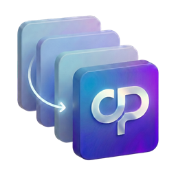
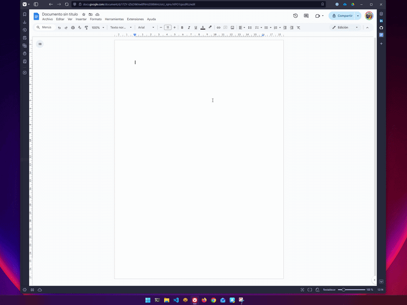
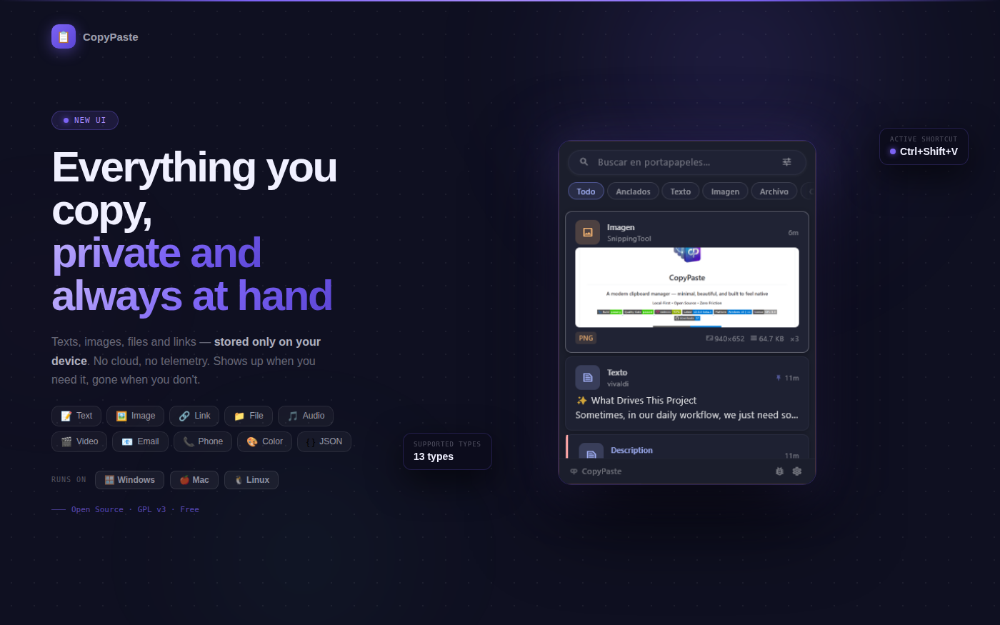
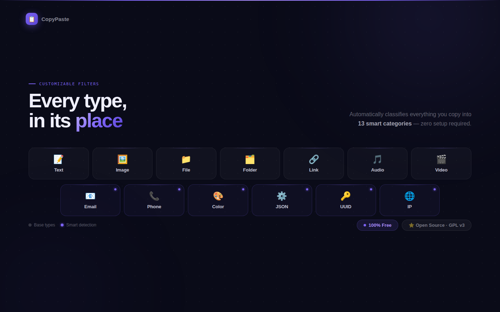
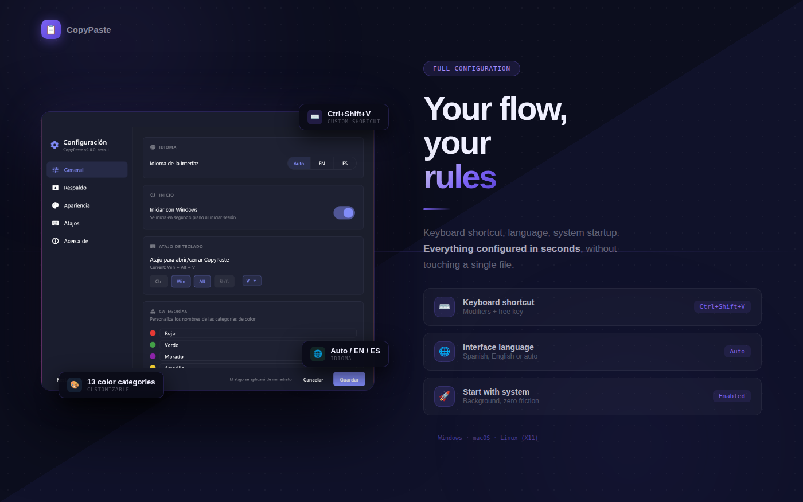
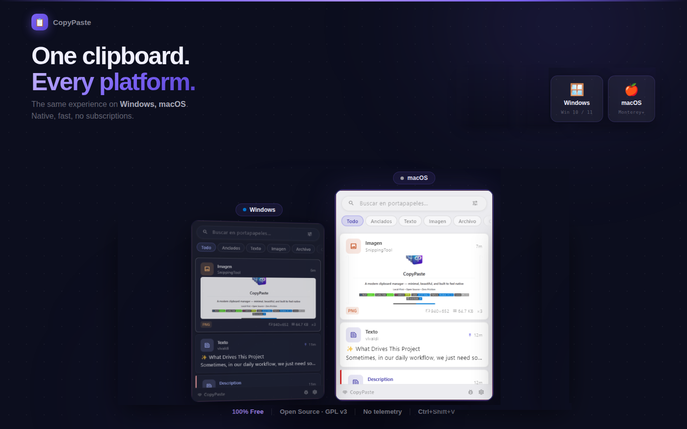

<div align="center">
  

  <h1>CopyPaste — Free Open Source Clipboard Manager</h1>
  <p><strong>A local-first clipboard history and copy paste tool for Windows and macOS.<br/>No ads. No telemetry. No accounts. Just a fast, private clipboard utility built for productivity.</strong></p>

  <p>
    <a href="https://github.com/rgdevment/CopyPaste/releases">
      
    </a>
    
    <a href="#license-and-spirit">
      
    </a>
    <a href="https://github.com/sponsors/rgdevment">
      
    </a>
    <a href="https://buymeacoffee.com/rgdevment">
      
    </a>
  </p>

  <p><strong>CopyPaste 3.0 is here</strong> — rewritten in Rust, for Windows and macOS.<br/>
  Get it from <a href="https://github.com/rgdevment/CopyPaste/releases/latest">Releases</a>.</p>

  <h4>Download CopyPaste</h4>

  <p align="center">
    <a href="https://apps.microsoft.com/detail/9NBJRZF3K856">
      
    </a>
    &nbsp;
    <a href="#getting-started">
      
    </a>
  </p>

  <p align="center">
    <a href="https://rgdevment.com/copypaste/"><b>rgdevment.com/copypaste</b></a>
  </p>

  <p align="center">
    <sub>Prefer a direct download? <a href="https://github.com/rgdevment/CopyPaste/releases/latest">GitHub Releases</a> has standalone installers — Windows (.exe) · macOS (.dmg)</sub>
  </p>
</div>

---

**CopyPaste** is a free, open source **clipboard manager** and **clipboard history** tool I built because the alternatives frustrated me. Most copy paste utilities are either bloated, ugly, or treat you as a product. I wanted a **copy tool** that felt native, respected my privacy, and just worked — so I built one and shared it.

This isn't a company product. I'm a developer who needed a better **copy paste** tool for my desktop, built it for myself, and decided to open source it for anyone who feels the same. No ads, no telemetry, no subscriptions, no data collection — just a lightweight **clipboard utility** that lives on your machine and nowhere else.

**Why people choose CopyPaste over other clipboard managers:**

- **100% local** — your clipboard history never leaves your computer. No cloud, no servers, no accounts.
- **Truly free** — no premium tiers, no feature gates, no "free trial" tricks. GPL v3, forever.
  Only redistributing it inside a product of your own needs [separate terms](COMMERCIAL.md).
- **Cross-platform** — same native copy-paste experience on Windows and macOS.
- **Fast and light** — starts in milliseconds, uses minimal resources. You'll forget it's running.
- **Easy to read** — a clean, opaque panel that follows your system theme, light or dark, so what you copied is the first thing you see.

> I use CopyPaste every day on Windows 11 and macOS. If something feels off, [let me know](#found-a-bug-have-feedback) — this project keeps improving because of real-world use.

---

## Table of Contents

- [See It in Action](#see-copypaste-in-action)
- [Why I Built This](#why-i-built-this)
- [What It Is / What It Isn't](#what-it-is--what-it-isnt)
- [Who Is This For?](#who-is-this-for)
- [Privacy and Security](#privacy-and-security)
- [Clipboard Manager Features](#clipboard-manager-features)
- [Keyboard Shortcuts](#keyboard-shortcuts)
- [Getting Started](#getting-started)
- [FAQ](#faq)
- [Starting Over, and Taking It With You](#starting-over-and-taking-it-with-you)
- [Coming from CopyPaste 2](#coming-from-copypaste-2)
- [Found a Bug? Have Feedback?](#found-a-bug-have-feedback)
- [What's Coming and What's Changed](#whats-coming-and-whats-changed)
- [Localization](#localization-help-translate-copypaste)
- [Want to Help?](#want-to-help)
- [Tech Stack](#tech-stack-for-developers)
- [Themes](#themes)
- [Alternatives](#alternatives)
- [Other Tools by the Same Author](#other-tools-by-the-same-author)
- [Project health](#project-health)
- [License and Spirit](#license-and-spirit)
- [Acknowledgements](#acknowledgements)

## See CopyPaste in Action

<div align="center">
    
</div>
<div align="center"><em>Fast search, clean cards, and a native feel across Windows and macOS.</em></div>

<br/>

<div align="center">
    
    
    <br/><br/>
    
    
</div>

---

## Why I Built This

I'm not a company. I'm a developer who copies and pastes things hundreds of times a day — and got frustrated.

Most **clipboard managers** out there are either bloated, ugly, Windows-only, or silently collecting your data. In 2026, a **copy paste tool** should feel native, responsive, and beautiful on every platform. I couldn't find one that did, so I built my own.

**CopyPaste started as a personal productivity tool.** I needed a lightweight **copy history** utility that:

- Didn't hog system resources
- Looked and felt like part of my OS, not a widget dropped on top
- Worked on both Windows and macOS
- Didn't require an account, subscription, or internet connection
- Actually respected my privacy — not just claimed to

After months of using it myself, I realized others might need it too. So I open sourced it — no ads, no tracking, no strings attached for the people who use it.

Every line of code is public. You can read it, fork it, or learn from it. This is a **free, open source productivity tool** — a copy tool built from a real need. Redistributing it inside a product of your own is the one case that needs [separate terms](COMMERCIAL.md).

---

## What It Is / What It Isn't

**CopyPaste is:**

- A **local-first clipboard manager** and **clipboard history** app for Windows and macOS
- A fast, keyboard-driven **copy-paste utility** for daily productivity and workflow efficiency
- A **copy tool** you can trust — **open source** (GPL v3), inspect every line, fork it, contribute to it

**CopyPaste is not:**

- A cloud clipboard or sync service
- A telemetry or analytics tool
- A "platform" with accounts, subscriptions, or ads
- A corporate product — it's a personal project shared with the community

---

## Who Is This For?

If you copy and paste throughout your day, this **clipboard manager** is for you:

- **Developers** juggling code snippets, terminal commands, and log outputs — a real productivity boost
- **Students** collecting notes, quotes, and research sources into a searchable **copy history**
- **Writers and creators** reusing text fragments and assets across documents
- **Support and operations** teams handling repetitive copy-paste responses
- **Anyone** who wants a clean, private, free **clipboard history** tool on their computer

---

## Privacy and Security

**Everything stays local.** CopyPaste is built on a single, non-negotiable principle: your clipboard data never leaves your computer. This copy-paste tool was designed with privacy as the foundation, not an afterthought.

- **Local-only storage** — no cloud, no servers, no data syncing
- **No tracking** — no telemetry, no analytics, no hidden collection of any kind
- **No automatic reporting** — errors are logged locally; nothing is sent without your explicit action
- **Secrets marked as secret are never read** — what an app marks as secret or concealed when it copies, as most password managers (1Password, Bitwarden, etc.) do, never reaches the history
- **Log export is voluntary** — you choose when and what to share; logs never contain clipboard content

**By design, CopyPaste will never have:** accounts, subscriptions, ads, cloud sync, or "AI analysis" of your clipboard.

For responsible disclosure and security contact info, see [SECURITY.md](SECURITY.md).

<details>
<summary><strong>Where is my clipboard data stored?</strong></summary>

CopyPaste stores everything locally under your user profile. The 3.0 keeps one
folder with the history, the files behind it and its settings:

**Windows** — `%LOCALAPPDATA%\CopyPaste\`

**macOS** — `~/Library/Application Support/CopyPaste/`

| What | Where |
| :--- | :---- |
| History | `history.db` |
| Images and files | `blobs/` |
| Previews | `thumbs/` |
| Settings | `config.toml` |
| Logs | `logs/` |

</details>

If you care about privacy and control, this clipboard manager is made for you. Read the full [Privacy Policy](PRIVACY.md) for complete details.

## Clipboard Manager Features

**Latest Release** — See all features and improvements in the [Release Notes](https://github.com/rgdevment/CopyPaste/releases/latest).

### Privacy and Security

- **Private by Default:** All clipboard history stays on your computer. No cloud, no sync, no servers.
- **Respects Sensitive Data:** What an app marks as secret or concealed when it copies — most password managers (1Password, Bitwarden, etc.) do — is never read, so it never gets saved. A password or API key copied from anywhere else carries no such mark and is kept like any other copy; tokens get a kind of their own, so they are easy to find and delete.

### Design and Experience

- **Native where it matters:** The panel answers the keys of the system it runs on — Ctrl on Windows, ⌘ on a Mac — and lives in the tray or in the menu bar, where you expect to find it.
- **Follows your theme:** Light or dark, whichever your system is using, or the one you pick in Settings.
- **Fast and Lightweight:** Starts quickly and doesn't hog resources. Lightweight enough to forget it's running.

### Smart Clipboard Management

- **Handles Everything:** Text, images, files, folders, links, audio and video — with previews that understand what they are showing.
- **Knows What You Copied:** Fifteen kinds recognised on their own — code, JSON, links, emails, phone numbers, colours, IP addresses, UUIDs and tokens among them. Each gets its own icon and its own filter, and a JSON or a token opens already readable.
- **Finds Text Inside Images:** A screenshot is searchable by what it says, read on your machine by the system itself — Vision on macOS, `Windows.Media.Ocr` on Windows. Nothing is uploaded to read it.
- **Paste It as Something Else:** The same card pasted as plain text, or in another of the forms it carries, without touching what is stored.
- **Copy Without Pasting:** Put a card back on the clipboard and paste it yourself, later, wherever you want.
- **Open with Default App:** Files, images, links, emails and phone numbers open in whatever your system already uses. Links go through [LinkUnbound](https://github.com/rgdevment/LinkUnbound) when you have it installed, and to your browser when you do not.
- **Drag to Other Apps:** Drag any image, file, folder, audio or video card straight into another app — a browser upload zone, a chat, an editor, a folder. An image keeps the name you gave its card, or a unique one, so an upload form never turns down a second one as a duplicate `image.png`.
- **Images Land the Way the App Expects:** Paste a picture into a terminal and it arrives as the path to its file, on Windows and on macOS; editors with a terminal of their own (VS Code and the like) keep receiving the image. On Windows, an image pasted into a browser arrives with its own name, the same as a drag.

### Workflow and Productivity

- **Full Keyboard Navigation:** Search, move, pin, rename and paste without the mouse. The search box has the focus the moment the panel opens.
- **Smart Search:** Accent-insensitive full-text search across what you copied, the names you gave it, and the text read out of images.
- **A Name for Any Card:** Give a card a name and find it later by that name.
- **Filter by Kind:** Pick a kind from the strip, hold the modifier to add kinds instead of swapping them, or type `#image` straight into the search box.
- **Pin Important Items:** What you pin stays at the top, and nothing sweeps it away — not age, not the quota, not emptying the history.
- **Backup and Restore:** Export everything to a single `.cpbackup` file and import it anywhere, without losing what is already there.
- **Start with Your Session:** Optionally launch at login, on Windows and on macOS, without admin rights.
- **A Welcome That Teaches:** First run walks through the shortcut, where the app lives and how the panel works — and on a Mac, through the one permission it needs to paste for you.
- **Settings That Save Themselves:** Five sections — General, Keyboard shortcuts, History, Backup, About — with no Save or Cancel buttons.

### Storage Control

- **Keep for as Long as You Want:** 7, 30 (default) or 90 days, or Forever. Anything older than the window you choose goes on its own. Pinned items never do.
- **History Size:** No limit (default), 256 MB, 512 MB or 1 GB, in Settings → History. When the history outgrows it, the oldest unpinned item goes first, whatever its kind.
- **Native Thumbnails:** Previews for images, video and audio are generated by the system itself, not by a bundled decoder.

---

## Keyboard Shortcuts

CopyPaste keeps `Ctrl+V` under the active application's control and uses one
global shortcut of its own to open the history panel. On a Mac the panel answers
the keys of the system it runs on: ⌘ where Windows uses Ctrl, and the keys a Mac
keyboard does not have are replaced by the ones it does.

| Where | Windows | macOS | Action |
| :---- | :------ | :---- | :----- |
| App you're in | Ctrl+V | ⌘V | Normal paste. CopyPaste does not intercept it. |
| Anywhere | Ctrl+Alt+V | ⌥⌘V | Open the panel. Change it in Settings → Keyboard shortcuts; if another program already uses it, free alternatives are offered. |
| Panel | Enter | ⏎ | Paste the selected item. |
| Panel | Shift + Enter | ⇧⏎ | Paste as plain text. |
| Panel | Alt + Enter  ·  Ctrl + Enter | ⌥⏎  ·  ⌘⏎ | Open or close "Paste as…". |
| Paste as | ↑ ↓  ·  1–9  ·  Enter | ↑ ↓  ·  1–9  ·  ⏎ | Pick a form; a number pastes that form directly. |
| Paste as | Esc  ·  Tab | Esc  ·  ⇥ | Close the sheet. |
| Panel | ↑ ↓ | ↑ ↓ | Move through the list. |
| Panel | Right arrow | → | Open or close the card. |
| Panel | Click  ·  Double click | Click  ·  Double click | Open or close the card  ·  paste it. |
| Open card | Click the ⏎ / ⇧⏎ / Alt ⏎ chips | Click the ⏎ / ⇧⏎ / ⌥⏎ chips | Paste  ·  plain text  ·  paste as. |
| Panel | Tab  ·  Shift + Tab | ⇥  ·  ⇧⇥ | Cycle through the filters. |
| Panel | Ctrl + click a kind | ⌘ + click a kind | Add kinds instead of switching. |
| Panel | #image  ·  #folder | #image  ·  #folder | Filter by kind from the search box. |
| Panel (empty search) | Backspace | ⌫ | Remove the last tag. |
| Panel (empty search) | Delete | ⌘⌫ | Delete the selected item. |
| Panel | Ctrl + P | ⌘P | Pin or unpin. |
| Panel | F2  ·  Ctrl + E | F2  ·  ⌘E | Give it a name. |
| Panel | Ctrl + O | ⌘O | Open it outside. |
| Panel | Ctrl + 1  ·  Ctrl + 2 | ⌘1  ·  ⌘2 | Everything  ·  pinned only. |
| Panel | Alt + G  ·  Alt + T | ⌘G  ·  ⌘T | Open "Filter by kind" and pick one. |
| Panel | F1 | ⌘, (also F1) | Open Settings. |
| Panel | Esc | Esc | Close the panel. |

The search box always has the focus, so you type to search the moment the panel
opens. A word starting with `#` filters by kind (`#image`, `#link`, `#imagen`)
instead of searching for it.

### What the panel does with what you copied

**It opens where you left off and pastes back where you were.** The shortcut
brings it up over whatever you were writing in, and what you choose goes into
that application, not into a window you then have to leave.

**You type to find things.** The search box has the focus the moment the panel
appears, and it searches what you copied, the names you gave it and the text
read out of your screenshots. A word starting with `#` filters by kind instead
of searching for it, and the strip above the list does the same with a click —
hold the modifier and the clicks add kinds rather than swapping them.

**Each kind is shown the way that kind deserves.** Images as a grid or as rows,
video by its cover or compact, audio as a waveform or compact, a JSON by its
keys or raw, and files, links and folders by group or newest first. The panel
remembers which way you chose for each.

**A card opens where it is.** Click it and it unfolds in place with a preview
of what it holds; click again and it folds back. The list is grouped into Now,
Today, Yesterday and Earlier, each card with the time you copied it. A colour
sits on one row with its swatch and its `rgb()`, and a picture found by a search
shows its thumbnail right in the results.

**The actions are on the card.** Hover over one, or select it, and it offers to
open it, name it, copy it without pasting, paste it as something else (the
highlighted one), pin it and delete it. An open card adds clickable key chips:
⏎ to paste, ⇧⏎ for plain text, Alt ⏎ (⌥⏎ on a Mac) for "Paste as…". When the
file behind a card is gone, the card says **Not found** and only offers to
name, pin or delete it.

**"Paste as…" knows the kind.** Each card offers the forms it can take, without
touching what is stored:

| Kind | Forms |
| :--- | :---- |
| Formatted text | Plain text, Markdown |
| JSON | Formatted, minified, keys only, as a table |
| Colour | Hex, `rgb()`, `hsl()`, by its name |
| Link | Markdown, domain only, with its title |
| Code | Without line breaks, Markdown block, without indentation |
| Token | As a header, its contents (claims), as curl |
| Image | JPEG, the text read inside it |
| File or folder | Its path, its name |
| Text | As a quote, ALL CAPS, all lowercase |

A form appears only when it makes sense for that card: a colour with no common
name offers no name, and an image with no text in it offers no text.

**A card takes a name, and keeps it.** Give one a name and it is searchable by
that name afterwards, which is how a snippet you reach for every day stops being
something you scroll for.

**What you pin stays.** Nothing sweeps it away: not age, not the quota, not
emptying the history.

---

## Getting Started

| OS          | Recommended                       | Alternatives                                       |
| :---------- | :-------------------------------- | :------------------------------------------------- |
| **Windows** | Microsoft Store                   | Standalone `.exe` · winget (coming soon)           |
| **macOS**   | Homebrew                          | Standalone `.dmg`                                  |

After installing, open the panel with **Ctrl+Alt+V** on Windows or **⌥⌘V** on a
Mac. Both are customizable in Settings → Keyboard shortcuts, and the first run
walks you through it.

### Windows

**Microsoft Store** (recommended) — one click, automatic updates, no security warnings.

> [Install from the Microsoft Store](https://apps.microsoft.com/detail/9NBJRZF3K856)

**winget** — coming soon. CopyPaste is not in the winget catalogue yet.

> The [Scoop bucket](https://github.com/rgdevment/scoop-bucket) carries CopyPaste
> 2 and is not fed by the 3.0 release.

**Standalone `.exe`** — direct download from [GitHub Releases](https://github.com/rgdevment/CopyPaste/releases/latest). The installer is self-signed; see the [security note](#standalone-downloads) below.

---

### macOS

**Homebrew** (recommended) — picks the build for your chip, Apple Silicon or Intel, and tracks updates with `brew upgrade`:

```sh
brew tap rgdevment/tap && brew install --cask copypaste
```

Test versions, which arrive before anyone else's and can break, have a cask of
their own:

```sh
brew tap rgdevment/tap && brew install --cask copypaste-beta
```

**Standalone `.dmg`** — direct download from [GitHub Releases](https://github.com/rgdevment/CopyPaste/releases/latest), one per chip, with manual updates.

---

### Compatibility

| Platform    | Versions                                     | Architecture                      |
| :---------- | :------------------------------------------- | :-------------------------------- |
| **Windows** | Windows 10 (1809+), Windows 11               | x64                               |
| **macOS**   | Ventura (13.3+)                              | Apple Silicon or Intel, one build each |

### Standalone Downloads

Direct packages live on [GitHub Releases](https://github.com/rgdevment/CopyPaste/releases/latest):

| Platform    | File                       | Notes                                                                       |
| :---------- | :------------------------- | :-------------------------------------------------------------------------- |
| **Windows** | `copypaste-installer-<version>-windows-x86_64.exe` | Self-signed installer — see security note below     |
| **macOS**   | `copypaste-installer-<version>-macos-aarch64.dmg` · `copypaste-installer-<version>-macos-x86_64.dmg` | One per chip: Apple Silicon (`aarch64`) or Intel (`x86_64`) |

Each release also carries a `SHA256SUMS` file with the checksum of every
download, and a build attestation from GitHub that ties each file to the
workflow run in this repository that built it.

<details>
<summary><strong>Windows standalone: security warnings</strong></summary>

Since CopyPaste is an independent open source project, the installer uses a self-signed certificate. Windows and your browser may show security warnings — **this is normal and expected.**

- **Browser:** Chrome/Edge may block the download — click Keep or Keep anyway.
- **SmartScreen:** Click More info → Run anyway (only happens once).
- **Why?** Code signing certificates cost $200–800/year. The code is 100% open source — you can inspect every line. SHA256 checksums are provided for each release.

</details>

---

## FAQ

**Is CopyPaste free?**
Yes. Completely free and open source. No premium tiers, no subscriptions, no paywalls — ever. That covers using it anywhere, including across a company, and packaging it for a distribution or package manager. Only redistributing it inside a product of your own needs [separate terms](COMMERCIAL.md).

**Does it upload my clipboard data?**
No. Everything stays on your machine. There is no cloud, no server, no sync. CopyPaste is a local-first clipboard manager by design — your copy paste data never leaves your computer.

**Does it store passwords?**
Not what an app marks as secret. Most password managers mark what they copy as secret or concealed, and CopyPaste never reads it. A password copied from an ordinary place, such as a text file, carries no mark and is kept like any other text. The [Privacy Policy](PRIVACY.md#sensitive-data-protection) explains the limits.

**Do I need internet to use it?**
No. CopyPaste works fully offline. Outside the Microsoft Store it makes a lightweight check for updates when you open Settings → About, at most once a day (no user data sent), but works perfectly without a connection.

**Does it sync clipboard history between devices?**
No. There's intentionally no cloud sync. Your copy history stays on the device where you copied it. This is a local-first copy tool, not a cloud service.

**Where is my clipboard history stored?**
Windows: `%LOCALAPPDATA%\CopyPaste\` — macOS: `~/Library/Application Support/CopyPaste/`. Each folder contains the database, images, config, and logs.

**What platforms does this copy-paste tool support?**
Windows 10/11 and macOS (Ventura 13.3+).

**Does it start with my session?**
Optionally, yes, on both systems. Enable it in Settings → General. On Windows it registers through the standard startup mechanism, and on macOS through a login item of its own. No administrator rights are required.

**Does the macOS version work on Intel Macs?**
Yes. There is a build for each chip, Apple Silicon and Intel. Homebrew picks the right one for you, and the Releases page carries both.

**Can it replace the Windows clipboard history (Win+V)?**
Yes. Win+V keeps your last 25 items and forgets the unpinned ones when Windows restarts. CopyPaste keeps what you copy for as long as you choose, searchable in milliseconds, with images, files, links and colours as cards you can pin, name and paste in another form. It opens with its own shortcut, so Win+V stays where it is.

**How do I paste as plain text?**
Open the panel and press **Shift+Enter** (⇧⏎ on a Mac). **Alt+Enter** (⌥⏎) offers the other forms a card carries, such as Markdown, formatted JSON or a colour in another notation.

**Can I drag an image or a file from the history into another app?**
Yes, on Windows and macOS. Drag a card into a browser upload, a chat or a folder. An image arrives with the name you gave its card, or a unique one, so an upload form never rejects a second image as a duplicate `image.png`.

**Is it an alternative to Ditto, Maccy or CopyQ?**
Yes. The [Alternatives](#alternatives) section compares them honestly, including where each of them is the better choice.

**How is CopyPaste different from other clipboard managers?**
CopyPaste is a personal project, not a company product. There are no ads, no telemetry, no accounts, and no data collection. Unlike most copy paste tools, it's built to feel native on each platform, it's fully keyboard-driven, and it respects your privacy completely. It's an open source clipboard utility focused on productivity — you can verify every line of code yourself.

---

## Found a Bug? Have Feedback?

**Your feedback shapes what gets built next.** Here's how to reach me:

| What you need | How |
| :------------ | :-- |
| **Report a bug** | [Open an issue](https://github.com/rgdevment/CopyPaste/issues/new) — tell me what happened and how to reproduce it |
| **Suggest a feature** | [Open an issue](https://github.com/rgdevment/CopyPaste/issues/new) — tell me what you'd like to see |
| **Ask a question** | [Start a discussion](https://github.com/rgdevment/CopyPaste/discussions) — ask anything, or just say hi |
| **Show support** | Star the repo — it is how other people find this clipboard manager |
| **Contribute code** | [Read CONTRIBUTING.md](CONTRIBUTING.md) — pull requests welcome |

**When reporting a bug, include** your system and its version, what you were
doing, what you expected, and the version shown in **Settings → About**.

### The logs, if they help

CopyPaste writes two plain-text log files beside your history —
`logs/cp-gui.log` for the settings window and `logs/cp-panel.log` for the panel.
**Settings → History → Data folder → Open folder** takes you there.

They hold application events and errors, never what you copied, and nothing in
them is sent anywhere: attaching one to an issue is a file you choose and drag
in yourself, after reading it if you want to.

---

## Starting Over, and Taking It With You

Everything here is in **Settings**, and nothing of it reaches the network.

### Emptying the history

**Settings → History → Empty the history** deletes everything you copied and
**keeps what you pinned**. It cannot be undone.

### Taking it to another machine

**Settings → Backup → Export** writes a single `.cpbackup` file with everything:
text, images and what you pinned. **Import** adds what the file holds to the
history you already have, without losing any of it, so the same file can be
restored twice without making a mess.

### A completely clean slate

Quit CopyPaste from the tray (Windows) or the menu bar (macOS) and delete the
data folder listed above. **Settings → History → Data folder → Open folder**
takes you to it. Starting it again is a fresh installation, welcome tour
included.

---

## Coming from CopyPaste 2

Nothing of CopyPaste 2 moves unless you ask.

- **Bring your history over.** **Settings → Backup → Bring the history over**
  reads the CopyPaste 2 history on this computer — on Windows also the one the
  Microsoft Store version keeps inside its package — and says what will not
  cross before it starts. The welcome tour offers the same the first time you
  open 3.0.
- **CopyPaste 2 is only read.** Its files stay where they are. When you no
  longer want them, **Delete CopyPaste 2's data**, in the same place and behind
  a confirmation, removes them. The files you copied are never touched.
- **The Windows installer notices CopyPaste 2** and offers to close and remove
  it, so the two do not fight over the same shortcut. Your history is left
  untouched either way. A Microsoft Store copy that keeps its history inside
  its package is only closed, never removed.

---

## What's Coming and What's Changed

I keep a clear record of what's been added, fixed, and planned:

**[View Release Notes & Changelog](https://github.com/rgdevment/CopyPaste/releases)** — complete history of all changes.

---

## Localization: Help Translate CopyPaste

CopyPaste should speak your language. Currently it supports English and Spanish, but the goal is to reach people everywhere.

### Currently Supported Languages

| Language            |  Tag  |  Status  |
| :------------------ | :---: | :------: |
| Spanish (Chile)     | es-CL | Complete |
| English (US)        | en-US | Complete |

### How It Works

- **Automatic Detection:** The app detects your system language and applies the appropriate translation.
- **Fallback:** Any system language that starts with `en` gets English; every other language, and every other region (e.g., es-MX), gets Spanish.
- **Manual Override:** You can force a specific language in the Settings panel.

### Help Add a New Language

CopyPaste is written in two languages at once, and every string sits next to its
twin. There is no translation file format to learn: the pairs live in the code.

#### Where the words are

| File                             | What speaks through it                                  |
| :------------------------------- | :------------------------------------------------------ |
| `app/src/locales.ts`             | The settings window. One `ES` object and one `EN` object. |
| `crates/cp-panel/src/view.rs`    | The panel: kinds, paste-as forms, empty states, counts.  |
| `crates/cp-panel/src/age.rs`     | How old a copy reads on its card, and the day groups.    |
| `crates/cp-panel/src/ways.rs`, `excuse.rs`, `folder.rs`, `shape.rs`, `token.rs`, `app.rs` | The rest of the panel's words: the views, why a paste did not go through, sheet titles and smaller pieces. |
| `app/src-tauri/src/tray.rs`      | The four entries in the tray menu.                       |
| `app/src-tauri/installer.nsi`    | The Windows installer's own messages.                    |

In Rust the pairs are written `("español", "english")` and picked by
`say::pick`. In TypeScript they are two objects with the same keys. The
installer template picks its messages with `$LANGUAGE`.

#### Steps to add a language

1. **Create a branch** from main.
2. **Widen the pair into a choice.** A third language means `say::pick` and
   `locales.ts` stop being a pair and become a lookup — open an issue first so
   the shape is agreed before anyone translates 300 strings into a dead end.
3. **Translate**, keeping the keys and the placeholders (`{one}`) untouched.
4. **Check it** with `cargo test -p cp-panel` and `npm test`: both suites assert
   that nothing is left empty and that the tongues actually differ.
5. **Submit a pull request.**

#### Translation Guidelines

- Keep translations concise — UI space is limited
- Use a neutral tone, and address the reader informally
- Preserve placeholders like `{one}`
- Don't translate brand names (CopyPaste, Windows, etc.)
- Don't change the keys, only what they say

---

## Want to Help?

Contributions are always appreciated — whether that's a bug report, a translation, or a pull request:

- **Write Code** — Fix bugs or add features. See [CONTRIBUTING.md](CONTRIBUTING.md) for setup.
- **Translate** — Add your language. [See guide](#localization-help-translate-copypaste).
- **Report Bugs** — If something breaks, [open an issue](https://github.com/rgdevment/CopyPaste/issues/new).
- **Share Ideas** — Tell me what you wish this clipboard manager could do.

---

## Tech Stack (For Developers)

If you're curious about what's under the hood of this open source clipboard manager:

| Technology                        | Why                                                                                                    |
| :-------------------------------- | :----------------------------------------------------------------------------------------------------- |
| **Rust**                          | One workspace, eight crates, no `unsafe` outside the two that talk to the operating system.            |
| **Tauri 2**                       | The settings window, the tray icon, the global shortcut and the updater.                               |
| **React + TypeScript**            | What the settings window is made of. It is the only part that runs in a webview.                       |
| **Slint**                         | The panel itself, drawn by a separate process so the history opens without waiting for a webview.      |
| **Sidecar over stdin**            | The app starts the panel and speaks four words to it — show, hide, empty, quit. Nothing else crosses.   |
| **SQLite (rusqlite) + FTS5**      | Local database with full-text search across content, labels, source app and recognised text.           |
| **Win32 / AppKit, direct**        | `cp-win-sys` and `cp-mac-sys` call the system themselves: clipboard, keystrokes, thumbnails, OCR.       |
| **Windows OCR / Apple Vision**    | Text inside an image is read on the machine, by the system, and becomes searchable.                     |
| **blake3 + xxHash**               | What identifies a copy and what recognises it again, so the same thing twice is one row that rises.     |
| **Updates (outside the Store)**   | The app reads `release-manifest.json` on the `manifest` branch, then downloads from `latest.json` or `candidate.json`, with minisign signatures bound to their version — see RELEASING.md. |

---

## Themes

CopyPaste follows your system theme automatically — no configuration needed.

- **Light** — Clean and bright, matching a light OS theme.
- **Dark** — Easy on the eyes, matching a dark OS theme.
- You can override the automatic selection in **Settings → General → Theme**.

---

## Alternatives

Other clipboard managers, so you can pick the one that fits. Platform, where
your data lives and licence were checked against each project in October 2026;
everything else changes, so go and look.

| Project | Platform | Where your data lives | Licence |
| :-- | :-- | :-- | :-- |
| **CopyPaste** | Windows, macOS | Your disk, no account | GPL-3.0 |
| [Ditto](https://github.com/sabrogden/Ditto) | Windows | Your disk; can sync between your own machines | GPL-3.0 |
| [CopyQ](https://github.com/hluk/CopyQ) | Windows, macOS, Linux | Your disk | GPL-3.0 |
| [Maccy](https://github.com/p0deje/Maccy) | macOS | Your disk | MIT |
| [Clipy](https://github.com/Clipy/Clipy) | macOS | Your disk | MIT |
| [Flycut](https://github.com/TermiT/Flycut) | macOS | Your disk | MIT |
| [Paste](https://pasteapp.io) | macOS, iOS | Their cloud to sync | Paid, closed source |
| [Raycast](https://www.raycast.com) | macOS | Your disk, with their service behind other features | Freemium, closed source |
| Clipboard history | Windows, built in | Your disk; Microsoft's cloud if you turn syncing on | Part of Windows |

What CopyPaste does that most of these do not: **one application on Windows and
macOS** rather than one per system, **text read out of your screenshots** so a
picture is searchable by what it says, **fifteen kinds recognised on their own**
with a view that suits each, and **pasting the same card in another form**
without touching what is stored.

Each of them is better than CopyPaste at something. CopyQ is scriptable to a
degree nothing here matches and runs on Linux too. Maccy is smaller and faster
to reach for. Ditto has years of Windows polish and syncing between machines.
Raycast is a whole launcher that happens to keep a clipboard. Pick what fits the
way you work.

---

## Other Tools by the Same Author

I build free, open source tools focused on privacy and productivity. If you like CopyPaste, you might also find these useful:

<p align="center">
  <a href="https://rgdevment.com/linkunbound/">
    
  </a>
</p>

### [LinkUnbound](https://rgdevment.com/linkunbound/)

A free, open source browser picker for Windows and Mac. Every link you click gets intercepted — domain rules open the assigned browser instantly, or a small picker appears near your cursor to let you choose. Resolves Microsoft SafeLinks and redirect wrappers before matching rules.

No ads. No telemetry. No accounts. Everything local.

### [Tisty](https://rgdevment.com/tisty/)

Notes, documents and tasks that stay on your machine, in plain files you can read
without it. Same rules as everything else here: no accounts, no telemetry, no cloud.

---

## Project health

<p>
  <a href="https://github.com/rgdevment/CopyPaste/actions/workflows/ci.yml">
    
  </a>
  <a href="https://github.com/rgdevment/CopyPaste/actions/workflows/mutants-sweep.yml">
    
  </a>
  <a href="https://github.com/rgdevment/CopyPaste/actions/workflows/rules.yml">
    
  </a>
</p>

The build runs on macOS and on Windows, the tests are run four times over on
both to catch anything that only passes once, and the mutation score measures
whether those tests would notice a change rather than merely cover the line.

---

## License and Spirit

**CopyPaste** — A modern, open source clipboard manager and copy-paste tool for Windows and macOS.
Copyright (C) 2026 Mario Hidalgo G. (rgdevment)

This program comes with ABSOLUTELY NO WARRANTY.
This is free software, and you are welcome to redistribute it under certain conditions.
Distributed under the **GNU General Public License v3.0**. See [LICENSE](LICENSE) for more information.

CopyPaste is dual licensed. The GPL-3.0 covers everyone using, deploying,
auditing, packaging or forking it — which is almost everybody, and it costs
nothing. Redistributing it inside a product of your own needs separate terms:
see [COMMERCIAL.md](COMMERCIAL.md).

Packaging it for a distribution or package manager is ordinary GPL
redistribution and needs no permission from anyone.

Contributions require a one-time [CLA](CLA.md); you keep the copyright on your
work.

---

I built CopyPaste because I was tired of the alternatives — bloated, resource-hungry, or disrespectful of my privacy. This is a personal copy paste productivity tool, built from a real need, shared because others might need a better clipboard manager too. Free to use, free to inspect, free forever. No analytics, no subscription, no upsell.

If you find it useful, I'm glad. If you want to help make it better, even better.

## Acknowledgements

CopyPaste stands on other people's open source work, every piece of it listed
with its licence in [THIRD-PARTY-BUNDLED.md](THIRD-PARTY-BUNDLED.md), with the
licence texts in [THIRD-PARTY-LICENSES.md](THIRD-PARTY-LICENSES.md), and both
shown in the app under **About**. The panel is drawn with
[Slint](https://slint.dev).

<p align="center">
  <a href="https://slint.dev">
    
  </a>
</p>

<div align="center">
  <p>Built with care and too much coffee.</p>
</div>
